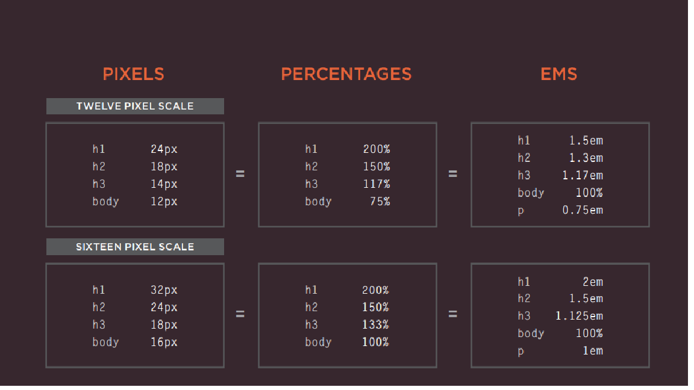
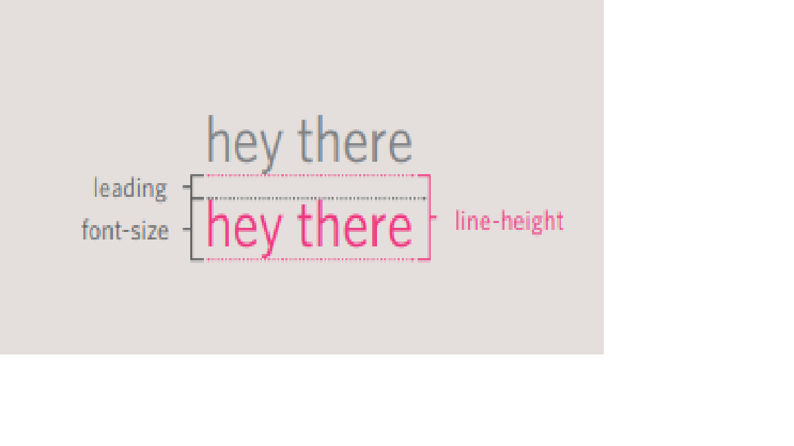
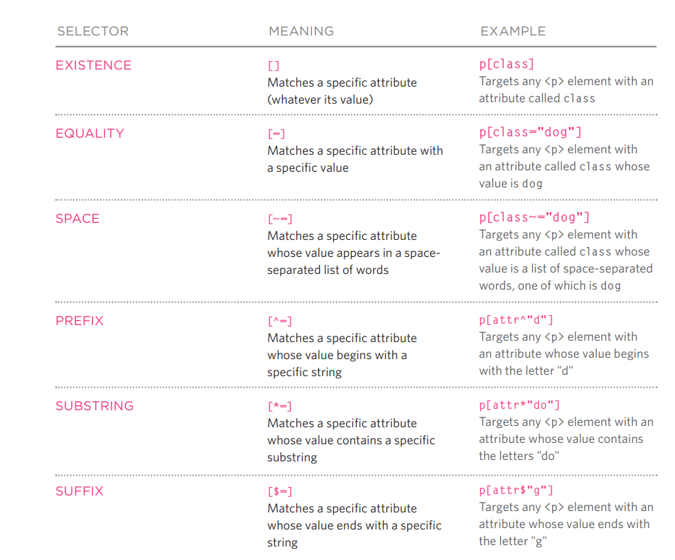

# Duckett HTML:

### Chapter 5: Image

**Adding images**: use < img> element to add image. The < img> element has two attributes:

 1-	src: I write the link “URL” of the image  
 2-	alt: used to provide a description of the image, if it is not appearing 

I can also add another two attributes to < img> element to control the width and height of the image:
 -	height: specify the height of the image in pixels
 -	width: : specify the width of the image in pixels

The location of the image is important and needs to be considered. Because the browser present the HTML element as follow:
 1-	Block element which will appear on a new line.
 2-	Inline element which will appear within a block level and not on a new line.

We have the “*align*” attribute, but this attribute has been removed from HTML5. And to apply this attribute you need to use through CSS, and there are 5 values: top, bottom, middle, right and left.

Three rule you need to take into consideration when creating images:
 1-	Save image in the right format: mainly websites use images in jpeg, gif, or png format.
 2-	Save image at the right size: the size I should save it because this size will appear on the browser. 
 3-	Use the correct resolution

**Cropping Images**: when you crop an image, it is important not to lose valuable info about the image.

**Image resolution**: computer save images and display them at resolution of 72 ppi (pixels per inch).

**Bitmap**: it is a type of image format, examples of this type: JPG’s, GIFs, and PNGs

**Vector images**: images created by programs such as Adobe Illustrator. These images are created by placing points on a grid, and drawing lines between those points. The advantage of creating line drawings in vector format is that you can increase the dimensions of the image without affecting the quality of it.

**Animated GIFs**: is shows several frames of an image in sequence.

**Figure and Figure caption**: the < figure> element can contain the image and its caption so both of them are associated. And I can add more than image inside the < figure> element as long as they have the same caption. 
And as for the < figurecaption> element used to add the caption.

### Chapter 11: Color

I can specify the color in CSS in 3 ways:  
 1-	Rgb: express the color is decided by the terms of red, green and blue. Its value ranges from 0-255 
 2-	Hex codes: six-digit code which represent the amount of red, green and blue. 
 3-	Color name

**Background color**: I can determine he background color by the same ways of determining the color.

Terms related to color:
 -	Hue: it like the slang (colloquial) term of color
 -	Saturation: it indicates the amount of gray in a color
 -	Brightness: indicates how much black in the color

**Opacity**: it is a property to determine the opacity an element. Its values ranges between 0.0-1.0.
In CSS3 I have a property “rgba” which adds a fourth values alpha “a” to the rgb, and this value to indicate the opacity and it ranges from 0.0-1.0

Another property “hsl” which stands for: 
 -	Hue: expressed in angles
 -	Saturation: expressed in percentages
 -	Lightness:  expressed in percentages
 -	Alpha: a fourth value added for the transparency and ranges between 0.0-1.0.
 

### Chapter 12: Text 

**Tpeface terminology**: 
 -	*Serif*: serif font has extra details on the ends of the main strokes of the letters
 -	*Sans-serif*: this font has straight ends to letters.
 -	*Monospace*: every letter in this font is the same width

Properties for the font:
 -	Weight: light/medium/bold/black
 -	Style: normal/oblique/italic
 -	Stretch: Condensed/regular/ extended

To take into consideration that when choose a typeface, it is important to understand that a browser will usually only display it if it's installed on that user's computer.

**To specify the typeface**: I use the “**font-family**” property to specify which typeface I would use.  The values of the property is the typeface that I want to use.

**Size of the type**: I have the “**font-size**” property so I can specify the size of the font and I have several ways to do it: 
 -	Pixels
 -	Percentages
 -	em: which is equivalent to the width of the letter m.

More font choice: 
I use “@font-face” to use font which is not installed to the computer of the person who is browsing.  I add the following for this process: 
 -	font-family: specifies the name of the font
 -	src: this is to specify the path to the font. 
 -	Format: specify the format that the font is supplied in.

**Bold**: the property “**font-weight**” used to create a bold text. There are two values for is: 
 - normal 
 - bold.

**Italic**: the property “**font-style**” used to create a italic text. There are three values for is:    
 - normal, 
 - italic 
 - oblique.

**Uppercase & Lowercase**: we use the “**text-transform**” property to change the case. There are three values for is: 
 -	uppercase: change the text to appear in uppercase
 -	lowercase: change the text to appear in lowercase
 -	capitalized: it only capitalizes the first letter

**Underlined & strike**: the “**text-decoration**” property used for this, and it has the following values:
 -	none: removes any decoration
 -	underline: add a line underneath the text
 -	overline: add a line top of the text 
 - 	line-through: add line through the text 
 -	blink: it makes the text animates like flash on and off

**Leading**: a term used for the vertical space between lines of text. In a typeface, the part of a letter that drops beneath the baseline is called a descender, while the highest point of a letter is called the ascender. Leading is measured from the bottom of the descender on one line to the top of the ascender on the next.

The property “**line-height**” sets the height of an entire line of text, so the difference between the font-size and the line-height is equivalent to the leading. And by increasing the line-height, it will make the vertical gap between lines of text larger.

**Letter word and spacing**: the property “**letter-spacing**” used to control the space between each letter. This attribute helpful when you have heading or sentence all in uppercase.
The property “**word-spacing”** to control the space between words.

**Alignment**: the “**text-align**” property used to set the alignment of the text and it has four values:
 1.	left: the text will be aligned to the left
 2.	right: the text will be aligned to the right
 3.	center: it will center the text
 4.	justify: indicates that every line of the paragraph will take the full width of the containing box except for the last one.

**Vertical Alignment**: the “**vertical-align**” property is commonly used with inline elements , it has the following values:
 -	baseline
 -	sub
 -	super
 -	top
 -	text top
 -	middle
 -	bottom
 -	text-bottom

**Indenting text**: the “**text-indent”** property used to indent the first line of text within an element. The line indented can be specified in pixels or ems. It can take a negative value, which means it can be used to push text off the browser window.

**Drop shadow**: the property “**text-shadow**” used to create a drop shadow, and can also be used to create an embossed effect by adding a shadow which is slightly lighter than the text. Its values take 3 lengths and a color.

 - The first length specifies how far from or right the shadow will fall.
 - The second length specifies the distance to the top or bottom the shadow will fall.
 - The third length specifies amount of blur and its optional.

**First letter or line**: use the “**:first-letter**” or “**:first-line**” next to the element to specify a value I want to change for the first letter or line.

**Styling links**: there are two pseudo-classes that set styles for the links that have/haven’t been visited:
 - "**:link**” this set style for link that have not been visited
 -	“**:visited**” this set style for link that have been visited

**Responding to the user**: there are 3 pseudo-classes which will the appearance of an elemenet when the user interacts with:
 1-	 “:hover”  used the user hover over an element 
 2-	“:active” applied when an element is activated
 3-	“:focus” applied when an element has focus. The focus occurs when the browser finds out that the user is ready to interact with the element 

**Attribute selector**:

