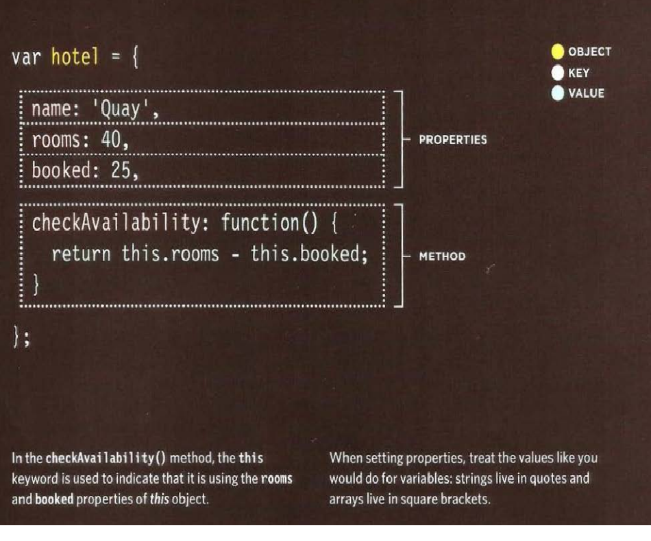
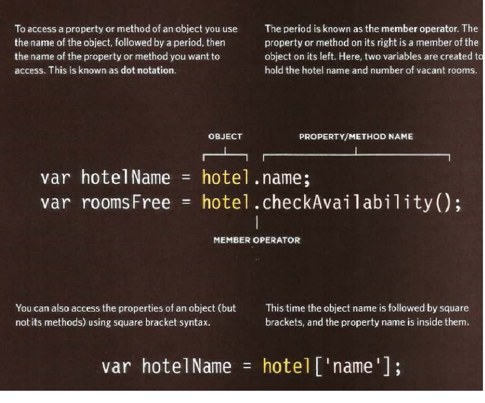
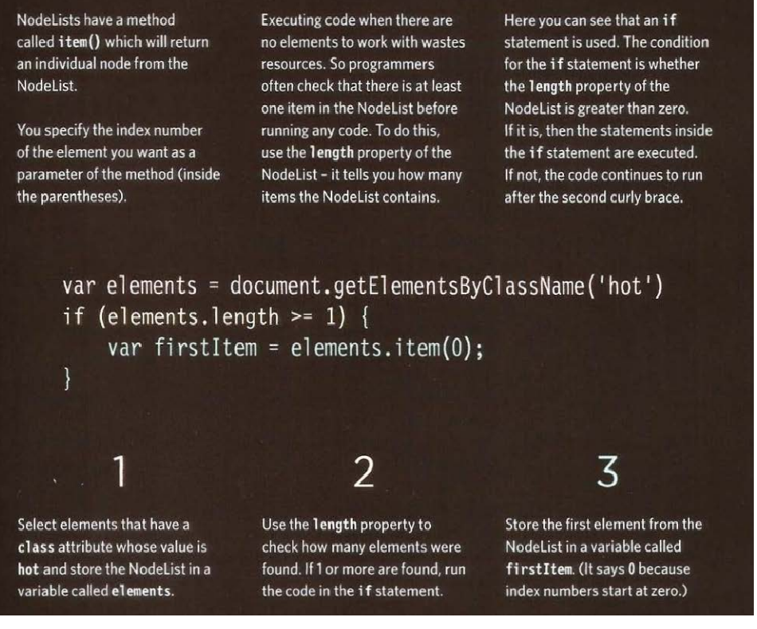
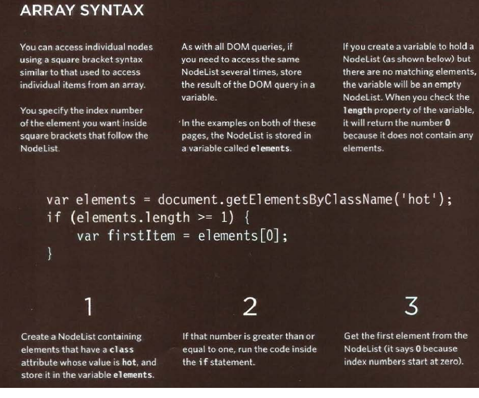
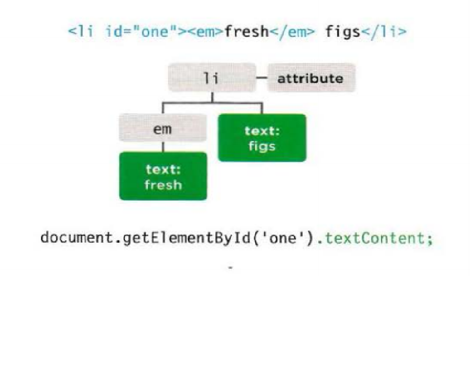
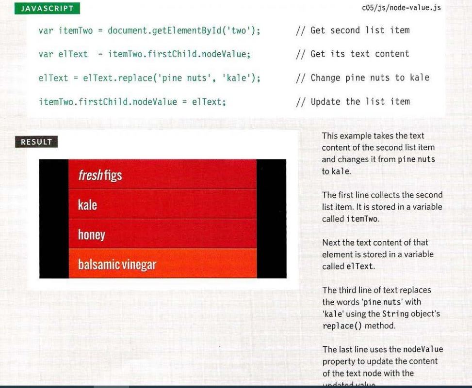
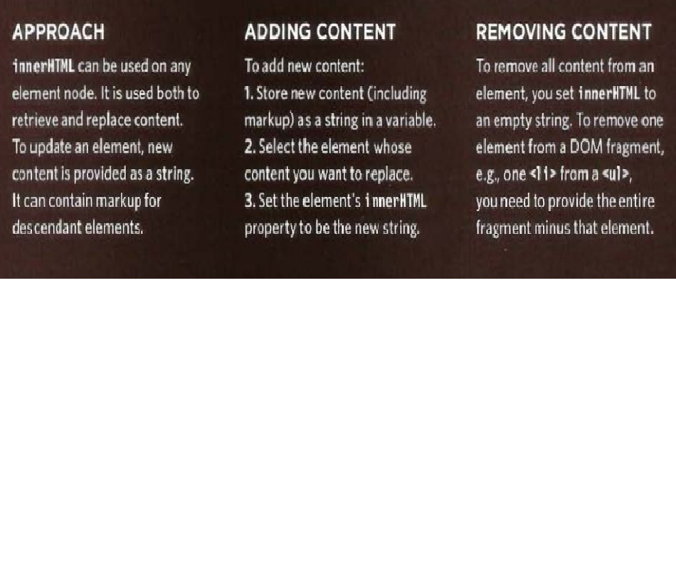
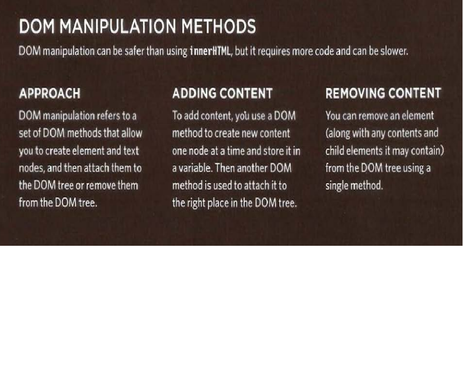
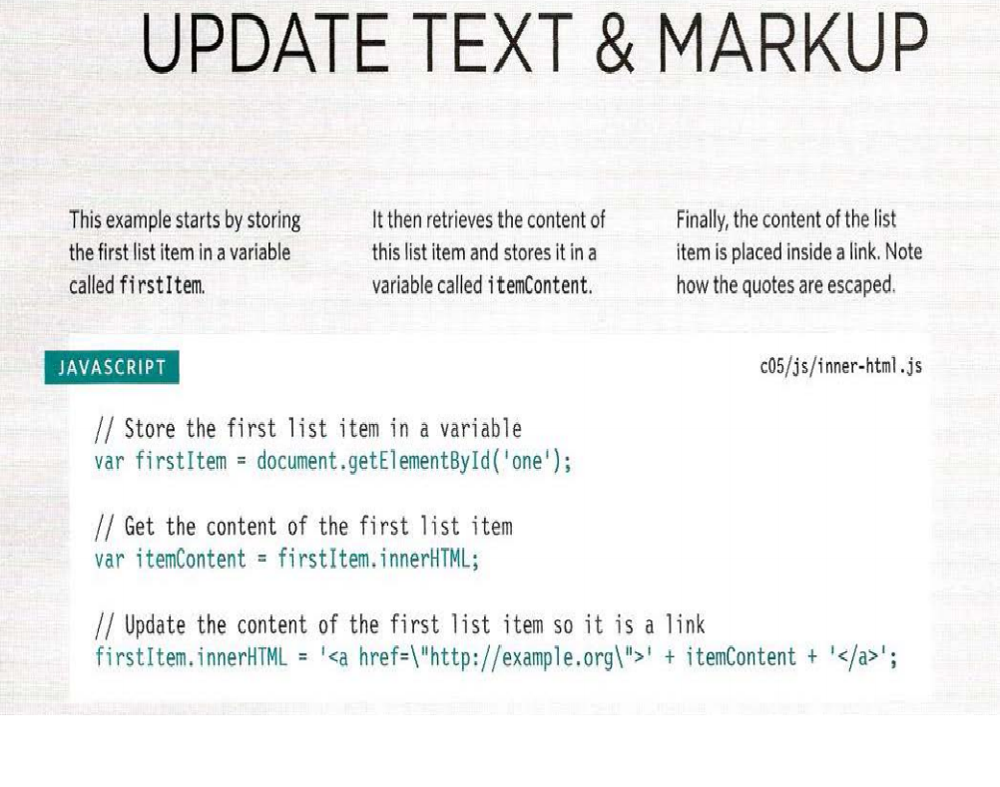
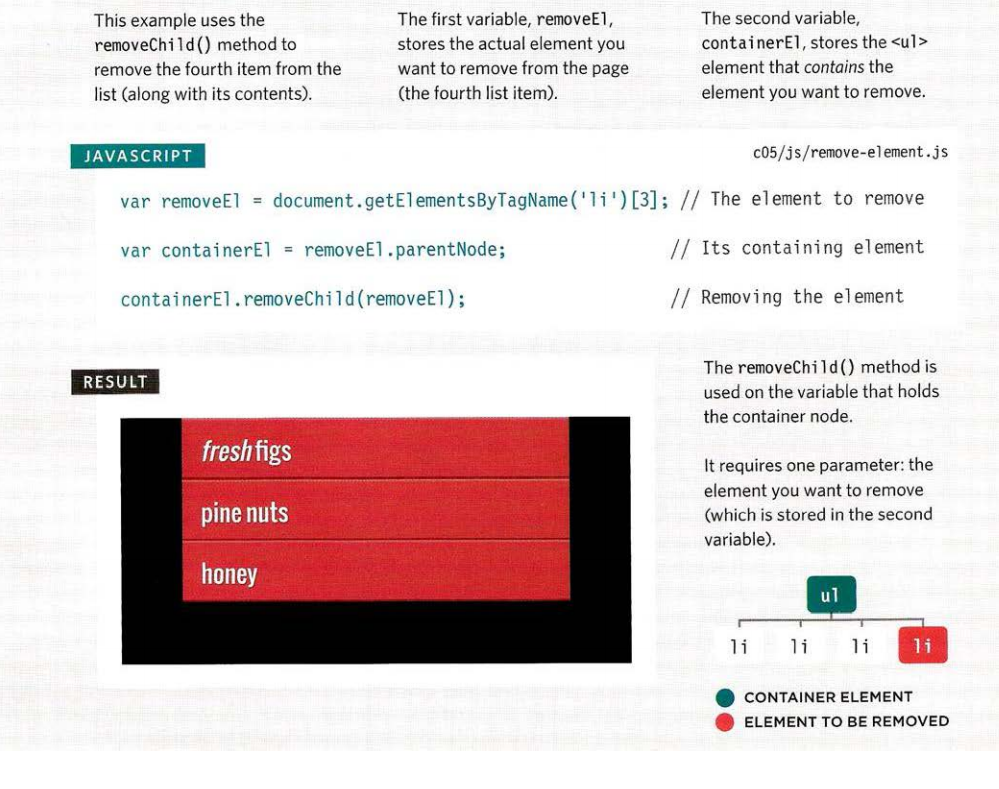

# Duckett JS: 

### Chapter 3: Objects Literals 100-105

**Object** is a group of variables and functions to create and represent a model in the real world. 
The **variable** that is part of an object is known as *property*. And it provides info about the object. 
The **function** that is part of an object is known as *method*. It represents the task.

*The value and the name of the variables and the functions in the object are called **Key**.* 
The value of the property can be: string, Boolean, number, array or even another object.

Literal notation is the most popular and easiest way to create objects, and it is as follows:

**Accessing an object**:
 -	First way is by using dot notation, to access property or method of an object is by: entering the name of the object followed by period, then the name of the property or method. And this known as dot notation.
The period is known as the member operator.
 -	Second way is only to access the properties and it works as follow: the object name followed by square bracket and the property inside the brackets.

Add photo--------------

### Chapter 5: Document Object Model 

**Document object model (DOM)** indicates how browsers should create a model of an HTML page and how JavaScript can access it and update the contents of a web page. The model of that page is called DOM tree, and it is consisted of 4 main types nodes. 

Every node is an object with methods and properties.  And scripts access and update the DOM tree.
To update the DOM tree, there are two steps:
 1-	Select the node and locte it which represent the element you want to change
 2-	Use the attribute, text or child element for the element I want

**DOM queries**: they are the method used to find element in the DOM tree.

- The variable used to store the location of an element in the DOM tree.

-The DOM queries may return one element or Nodelist which is a collection of nodes.

-The quicker to access to an element within a web page will make the page seems faster and more responsive. 

Methods that return a single element node:
 -	Using id attribute
 -	CSS selector that would select one element or more

Method that return one or more elements (AS A NODELIST):
 -	Using class attribute
 -	Using tag name
 -	CSS selector

Two ways of selecting an element from a Nodelist:
 
  1-	The item() method

 2-	Array syntax 

For both ways, we must check if the Nodelist contains nodes. The array syntax is more preferred than the item() method because it is much faster.

-	getElementByid() allows you to select a single element node by specifying the value of its id attribute. 
-	The get ElementsByClassName() method allows you to select elements whose class attribute contains a specific value.
-	The get ElementsByTagName() method allows you to select elements using their tag name.

-	querySelector() returns the first element node that matches the CSS-style selector. querySelectorAll () returns a Nodelist of all of the matches.

I can use loop to apply the same statement for each node in the Nodelist.

**Traversing the DOM**: It is possible to select another element if the element is in relation to the element node that I have and this is called Traversing the DOM. Using the following 5 properties: 

 1-	parentNode
 2-	perviousSibling/nextSibling
 3-	firstChild/lastChild

**Whitespace nodes**: this is cause to have difficulties when traversing through the DOM, because the pervious properties used for traversing will return different elements. One of the solutions is to remove all the whitespace, but this way is will make the code hard to read and understand. 
Another way is by using Javascript library. 

Accessing & updating text node with node value: by using the “nodeValue” property we can amend or retrieve the content of the element.

Example of of accessing and changing a node 

 

Access and update text with textcontent: using the “textContent” property to update or collect the text in the containing element and its children
Add photo example of textContent ---------------

Adding & removing HTML content: there are two approaches for add & removing HTML contents as follow:

 -	innerHTML property

 

 -	DOM manipulation

 

DOM manipulation is suited to target individual nodes in the DOM, but as for the innerHTML is better suited for the entire fragment to update.

The innerHTML can be used to access and update the content og an element including its child elements. 

Example of updating the text and markup

DOM manipulation of adding elements: there are 3 steps
 1-	Create element using “createElement()”
 2-	Give it contet using “createTextNode()”
 3-	Add it to DOM using “appendChild()”

DOM manipulation for removing element: there are 3 steps
 1-	Store the element to be removed in a variable
 2-	Store the parent of that element in a variable. The easiest way is by using “parentNode” property.
 3-	Remove element from its containing element, by “removeChild()” method used on the containing element in step 2.

Example of DOM manipulation removing:

Comparing techniques: updating HTML content 

 -	**document.write()**: is a simple way to add content which is not original in the source code to the page.

 -	**element.innerHTML**: used to update the whole content of any element as a string

 -	**DOM manipulation**: refers to the set of methods and properties to access, create and update elements and text nodes.

**Cross-site scripting attack (XSS)**:

This issue may occur when using innerHTML (or several jQuery methods. The attacker may add malicious code. 

The data that you do not have complete control over is known as untrusted data	 

The XSS can provide the attacker: 
 -	The DOM
 -	Website cookies
 -	Information which identify the user from others when logging into the site.

**Attribute nodes**:

It is possible to use properties and methods on the element node to access and change the attribute.
Two steps for this process of accessing and updating:

 1-	Select the element node followed by period.
 2-	Using one of the methods or properties to work/change the element attribute.

**Methods**: 
 -**getAttribute()**: gets the values of an attribute
 -**hasAttribute()**: check if the element node has a specified attribute
 -**setAttribute()**: set the value of an attribute
 -**removeAttribute()**: removes an attribute from element node

**Properties**: 
 -**className**: get/set the value of the class attribute
 -**id**: get/set the value of the id attribute
