# Duckett HTML

### Chapter 6: Table

**Basic Table Structure**: < table> used to create a table, and the content of the table written row by row.

**< tr>** opening tag to start the row, and in the end I use the closing tag of < tr>.  

**< td>** “table data” is used inside <tr> element, and each <td> represent a cell where I can enter the data. 

**< th>** elment used for adding heading for either column or row, and it works the same as <td>. 

- Even if there is no content we must use the <td> or <th> to represent the presence of an empty cell.

**Spanning column**: “**colspan**” attribute is used to stretch the entries of the data across more than one column. And the value of the attribute indicates how many columns to across. 

**Spanning row**: “**rowspan**” attribute is used to stretch the entries of the data across more than one row. And the value of the attribute indicates how many rows to across

**Long tables**: there are three elements used to distinguish between the main content of the table and the first and last rows:
 -	**< thead>**: used to write the headings of the table
 -	**< tbody>**: used to write the main content of the table
 -	**< tfoot>**: used to write the footer.

# Duckett JS

### Chapter 3: Functions, Method, and Objects

**Creating an object**: 
 
 **Constructor notation**: using the keyword “new” and the object constructor “Object()” to create a blank object.

**Updating an object**: to update the value of property can be done by:
 -	dot notation 
 -	square bracket

Also the property can be deleted using the keyword “**delete**” 

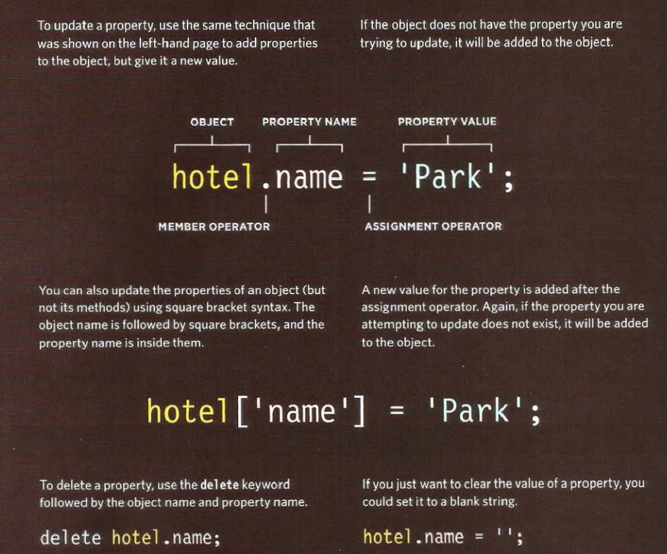

**Creating many objects**: using the constructor notation 

Object constructor can use a function as template for creating multiple objects.
First create a template as function (which will be an object template) with the object properties and methods. The parameters of the functions will work as values for the properties.

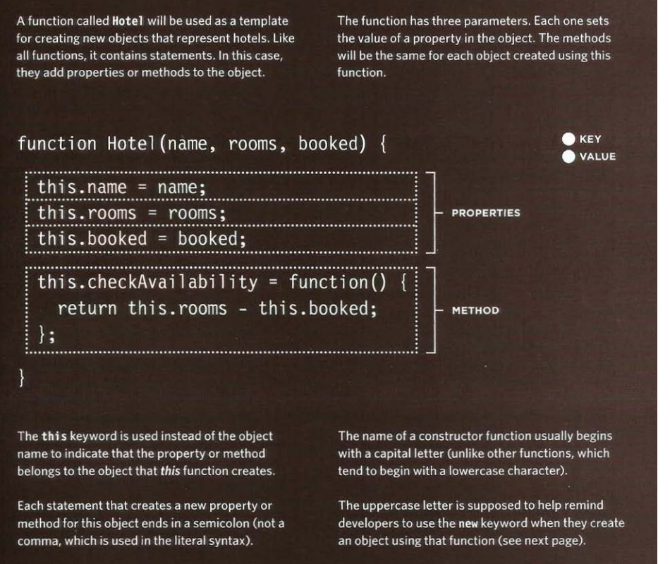 

Creating instances of the object. Using the keyword “new” followed by calling the function to create a new object.

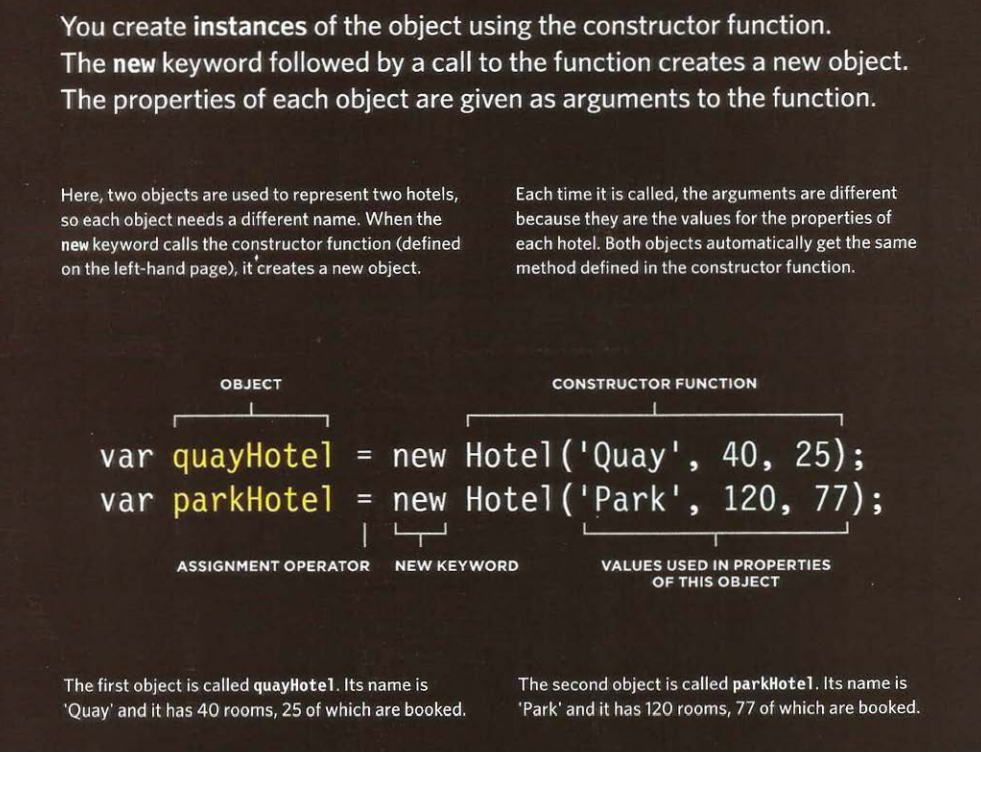 

Two ways of crating objects: (page 113)
 1-	Literal notation
 2-	Object constructor notation

- The arrays are built-in objects. We can add arrays and objects together to create a complex data structure.

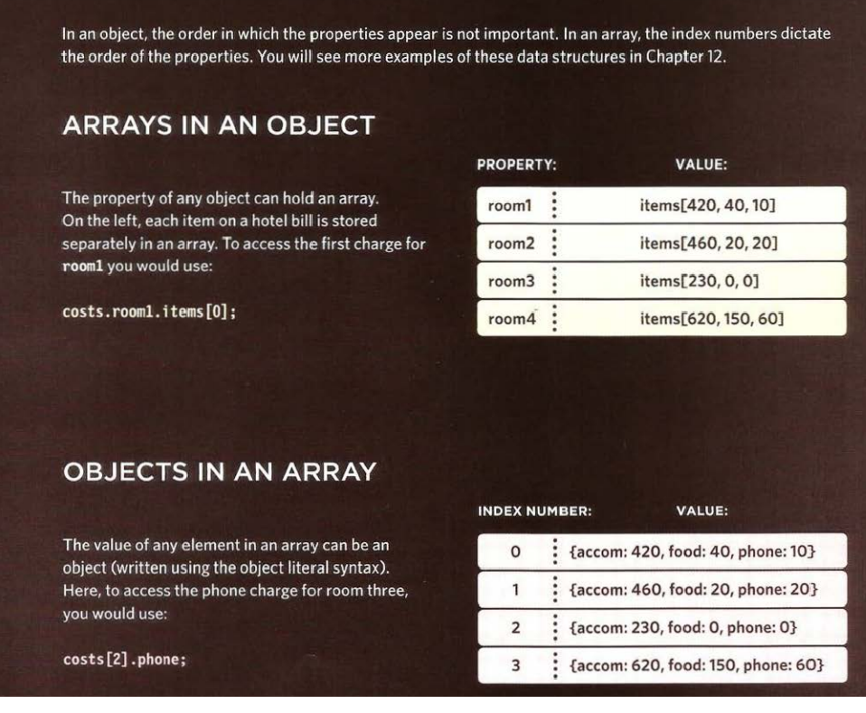

Three groups of built-in objects:

 1-	Browser object model: creates a model of the browser tab or window 

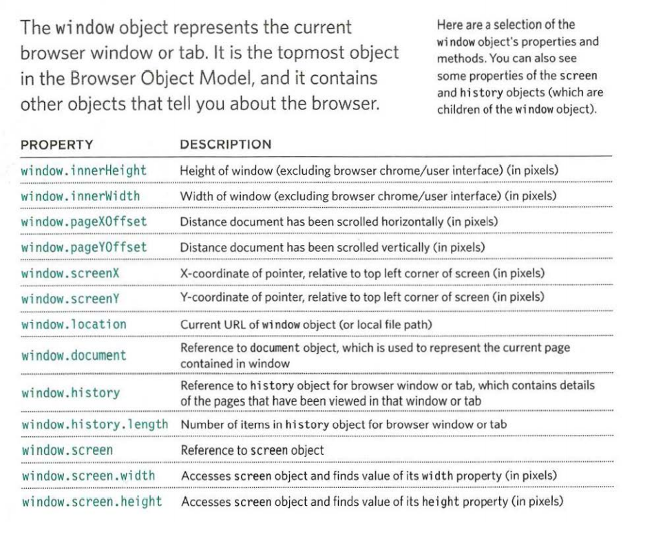 
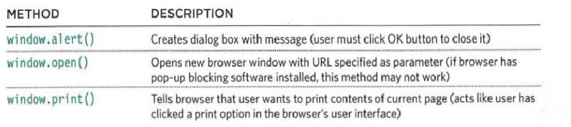 

 2-	Document object model: create model of the current page web page

 

 3-	Global JavaScript objects: they are group of individual objects that relate to different part of the JS language. 

String object:

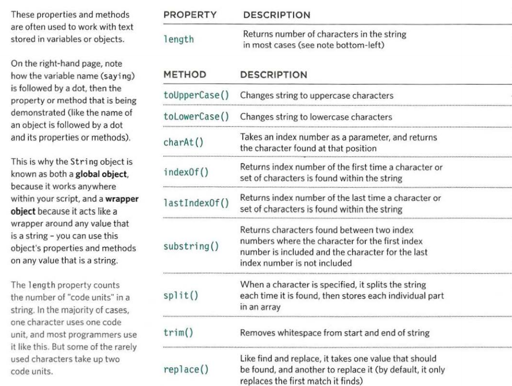 

Number object:

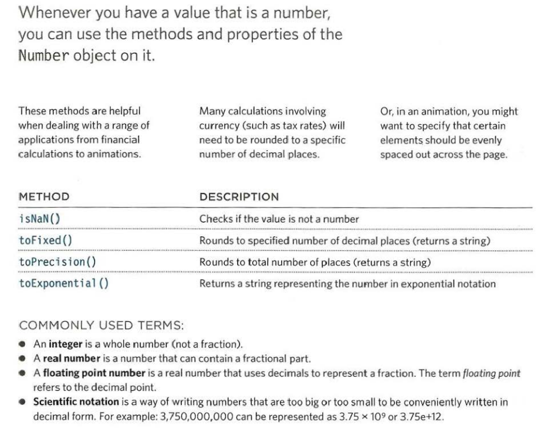 

Math object:

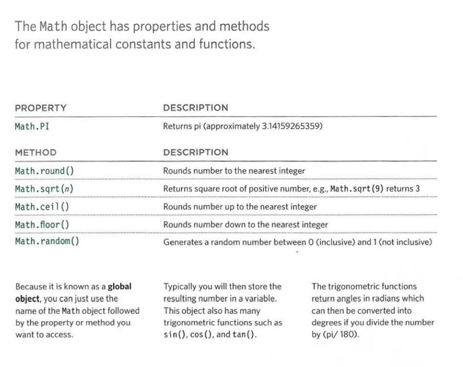 

Date object:

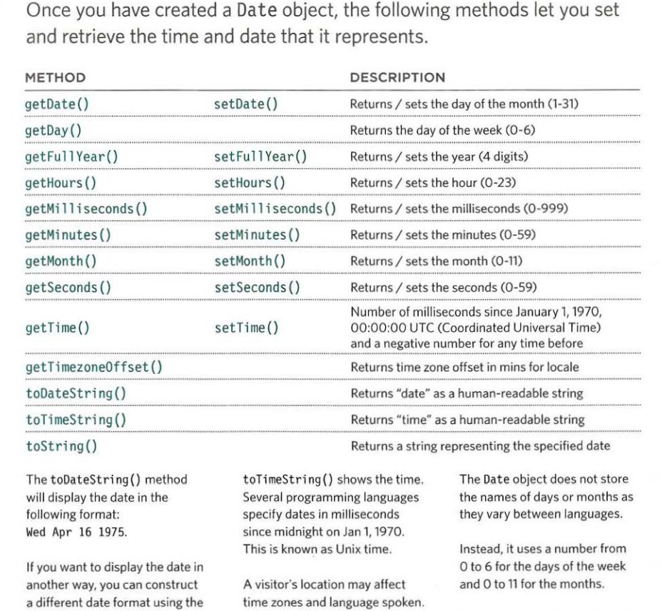 

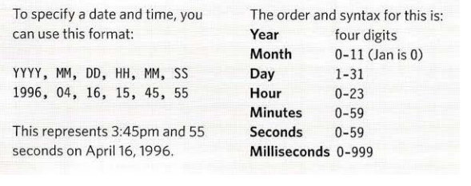

