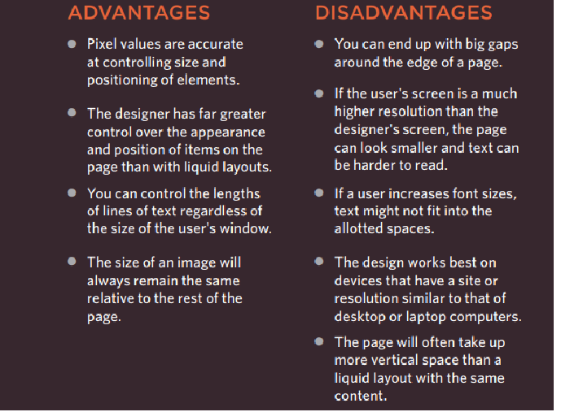
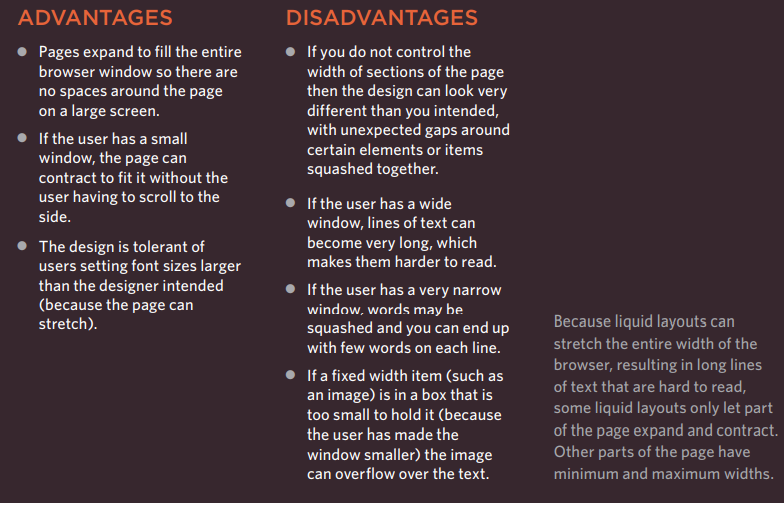
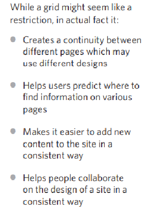

### Chapter 15 Layout   p. 358-370

Key concepts in positioning elements:
  -	**Building Block**: Block-level element act as the main the building block of the page layout, while the inline boxes flow between the surrounding text.

  -	**Containing element**: it the outer box that contains another block-level 

  -	**Controlling the position of elements**: in CSS there is Positioning Schemes which allows to control the layout of the page: 

  - **normal flow**: it appears every block-level element on a new line, which will show each item lower than the previous one.

  - **Relative positioning**: this will move the element from the position where it should be in normal flow to where it have been placed.

   - **Absolute positioning**: this will position the element in relation to its containing element.
 
   - **Fixed positioning**: it is a form of absolute positioning which position the element in relation to the browser element. Any element effected by fixed positioning does not affect the position of the surrounding element, and it does not move when the user scroll up/down the page.

   - **Floating element**: it takes out the element out of normal flow and position it to far right or left of its containing box.

- When you move element from overflow, an overlap can occur. The “z-index” property allows to control which box spear on the top.

**Normal Flow**: uses the property "**position: static;**" Each block-level element sits on top of the next one, but It does not need a CSS property to indicate the elements to appear in normal flow.

**Relative positioning**: uses the property” **position: relative;**”. It moves an element in relation to where it would have been in normal flow.

**Absolute positioning**: when the absolute property is applied the box is taken out of normal flow and does not affect the position of the surrounding elements. The property used for it “**position: absolute;**”.

**Fixed positioning**: type of an absolute positioning, which will position the element in relation to the browser window. The property is “**position: fixed;**”

**Overlapping elements**: when overlap occurs, it will show later HTML code sit on the earlier one. To control the overlap, we use the “**z-index**” property and its value is a number, and the larger the number is the closer element will appear on the front.

**Floating Elements**: it uses the “float” property to take an element in normal flow and place it to the far left or right of the containing element.

**Clearing Floats**: “**clear**” property indicates that no element (within the same containing element) should touch the left or right -hand sides of the box. It has 4 value:
 -	left: the left side of the box will not touch any other element that is in the same containing element
 -	right: right side of the box will not touch any other element that is in the same containing element
 -	 both: both sides of the box (right & left) will not touch any other element that is in the same containing element
 -	none: elements will not touch each other side.

**Creating multi-column layout with floats**: there are 3 properties used to set/position the columns next to each other:

 -	width: set the width of the column
 -	float: set the column next to each other
 -	margin: used to create gap between columns

**Fixed width layout**: the size does not change when the user increase or decrease the size of their browser window. The width of the boxes on the page will specified in pixels. 

 

**Liquid layout**: this design allows to stretch and contract as the user increase or decrease the size of the browser window. The width of the boxes on the page will specified in percentages. 

  

**Layout Grid**: used to help the designers to position items on the page 

 

CSS Framework: it provides the code from the common task, such as creating layout grids, styling forms, creating printer-friendly versions of pages and so on.

  

**Multiple Style sheets**: it is used when the author of the page split the CSS style rules into separate sheet styles.

Two ways to add multiple style sheets to a page:

 1-	The HTML page can link to one style sheet, and that stylesheet can use the “@import” rule to import other style sheets.
 2-	In the HTML you can use a separate < link> element for each style sheet.
