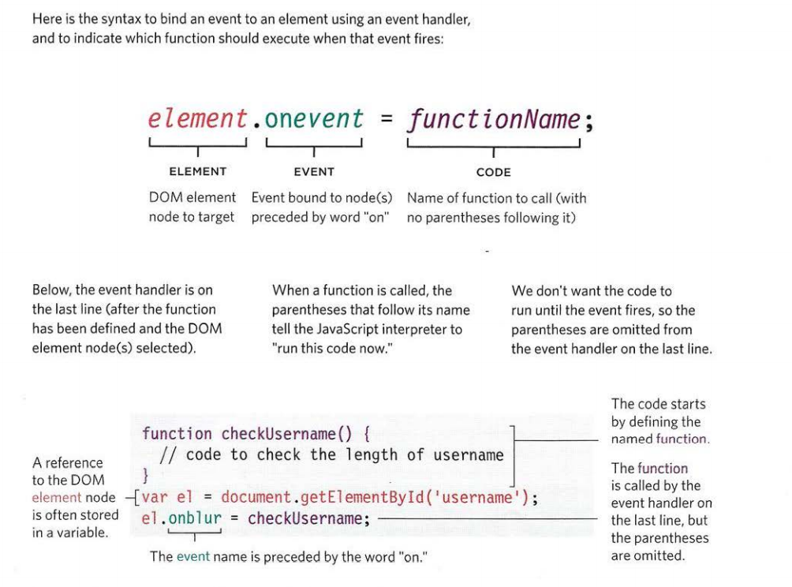
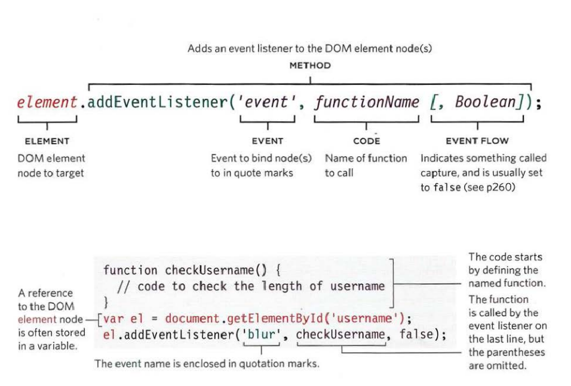
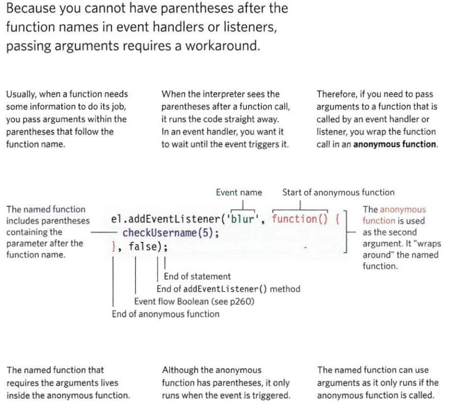

# Duckett HTML:

### Chapter 7: Forms

Form controls: used to collect info from the visitor to the site, such as: 
 -	Adding text: Text input, password input, text area
 -	Making choices: Radio button, Checkboxes, drop-down boxes
 -	Submitting forms: submit buttons, image button, 
 - 	Uploading files

**Form structure**: the form exists inside a < form> element, which will have usually action and method and id attributes:

 -	action: Its value is the URL for the page on the server that will receive the information in the form when it is submitted.
 -	method: sent using one of two methods: 

   1-get: using get method the values from the form are added to the end of the URL specified in the action attribute. Used for:
      -short forms
      -retrieving data from the web server

   2-post: post method the values are sent in what are known as HTTP headers. Used in form:
     - allows users to upload a file
     -very long
     -sensitive data
     - adds information to, or deletes information from, a database

 - id: used to identify the form distinctly from other elements on the page 

**Text input**: the < input> element used to create several different form controls. Value of the type attribute determines what kind of input they will be creating.

 -	type=”text”: e has a value of text; it creates a single line text input.
 -	name: identifies the form control and is sent along with the information
 -	size:
 -	maxlength: use the maxlength attribute to limit the number of characters a user may enter into the text field

**Password input**:

 -	type=”password”: a value of password it creates a text box.
 -	name: indicates the name of the password input which will be sent to the server
 -	size.maxlength: carry the size and maxlength attributes like the the single-line text input.

**Text area**: the < textarea> element is used to create a mutli-line text input

**Radio Button**:
 -	type=”radio”: allow users to pick just one of a number of options..
 -	namee value of the option the user selects 
 -	values: indicates the value that is sent to the server for the selected option
 - 	checked: used to indicate which value should be selected when the page loads. 

**Checkbox**:
 
 -	type=”checkbox”: allow users to select (and unselect) one or more options in answer to a question
 -	name: value of the option(s) the user selects 
 -	values: indicates the value that is sent to the server if the checkbox is checked
 -	checked: indicates that this box should be checked when the page loads.

**Drop down list box**: it allows user to select one option from a drop down list.

The **< select>** element used to create a drop down list box, and it contains two or more **< option>** elements.
The name attribute indicates the name of the form control being sent to the server.

The **< option>** element used to specify the options that the user can select from. And the text between the opening and the closing tags will be shown in the drop box.  

The attribute “value” indicate the value that is sent to the server along with the name of the control if this option is selected.  

The selected attribute can be used to indicate the option that should be selected when the page loads. The value of this attribute should be selected. 

**Multiple select box**: a drop down list can be turned to a box that shows more than one option by adding the **“size”** attribute. The value should be the number of options you want to show at once.

To allow users to select multiple options from this list by adding the **“multiple”** attribute with a value of multiple.

**File input boxv**: to allow users to upload a file. The (**type=”file”**) of input creates a box that looks like a text input followed by a browse button.

**Submit button**:

 -	type=”submit”: used to send a form to the server.
 -	name: it can be used or not 
 -	values: used to control the text that appears on a button

**Image Button**:

 -	type=”image”: use an image for the submit button, and it is optional to give the type attribute a value of image. The src, width, height, alt attributes work just 
 -	like they **do when used with the  element

**Button & hidden controls**:

 -	The < button> element was introduced to allow users more control over how their buttons appear
 -	The < input > element uses (type=”hidden”), and this form controls are not shown on the page.

**Labeling form controls**: < label> element used in either ways:
 1-	 Wrap around both the text description and the form input
 2-	Kept separate from the form control and use the for attribute to indicate which form control it is a label for.

The for attribute states which form control the label belongs to.

**Grouping form elements**: the **< fieldset>** elements used to relate form controls together.  

The **< legend>** element comes directly after the opening tag and contains a caption which helps identify the purpose of that group of form controls.

**Date input**: in the **< input>** element use and put the type of attribute as follows If you are asking the user for a date: type=”date” 

**Email & URL input**: in the < input> element use and put the type of attribute as follows If you are asking the user for an email: **type=”email”**  
. 
And  **type=”url”** If you are asking the user for url(a web page address). 

**Search input**: in the < input> element use and put the type of attribute to create a single line text box for search queries,  **type=”date”**. The “**placeholder**” attribute’s value is text that will be shown in the text box until the user clicks in that area.

### Chapter 14: Lists, Tables & Forms

**Bullet point styles**: the property “**list-style-point**” is used to control the shape of a bullet point. It can be applied on < ol> < ul> < li> elements.

For an unordered list I can have the following values:
 -	none
 -	dics
 -	circle
 -	square 

For an ordered list I can have the following values:
 -	decimal 
 -	decimal-leading-zero
 -	lower-alpha
 -	upper-alpha
 -	lower-roman
 -	upper-roman

**Images for bullet**: the property “**list-style-image**” to specify an image to act like a bullet. The value of the property is url letters followed by parentheses, inside them we have the path of the image between double quotes. => **list-style-image: url (“path”)**

**Positioning the marker**: the property “**list-style-position**” used to specify where the marker should appear on the inside or the outside of the box containing the main points. It has two values: 
 
 1-	outside: marker will set to the left of the block text. (And this is also the default behavior) 
 2-	inside: marker will set inside the box of text.

**List Shorthand**: the property “**list-style**” allows to express/specify the marker’s style, position and image properties in any order. (like it sum up all the pervious properties to be used at one time)

**Table properties**:
 -	width: set width of the table
 -	padding: to set space between each cell’s border and its content
 -	text-transform: used to convert the content of the table headings to uppercase
 -	letter-spacing, font-size:
 -	border-top, border-bottom: set borders for the table headers above and below.
 -	text-align to align the writing to left or right of table cells
 -	background-color: change background color of the alternating rows
 -	hover: to highlight table row when a mouse goes over it

**Border on empty cell**: using the property “empty-cell” to specify whether the border of an empty cell should be show or not. It takes 3 values:
 
 -	show: show border of any empty cell
 -	hide: hide border of any empty cell
 -	inherit: If you have one table nested inside another, the inherit value instructs the table cells to obey the rules of the containing table.

**Gaps between cells**: we have two properties for this:
 
 -	The first one is “border-spacing” used to control the space between adjacent cells. The value of this property usually in pixels and we can set two values for vertical and horizontal. 
 -	The second property “border-collapse” has two values: 
 -collapse: Borders are collapsed into a single border where possible.
 -separate: Borders are detached from each other.

**Styling Text inputs**: most common properties used with text input:

 -	color
 -	font-size
 -	background-color
 -	border
 -	border-radius
 -	background-image
 -	:focus pseudo-class is used to change the background color of the text input when it is being used
 -	:hover pseudo-class applies the same styles when the user hovers over them.

**Styling submit buttons**:  most common properties used with submit buttons:
 -	color
 -	text-shadow
 -	background-color
 - 	border-bottom
 -	:hover pseudo-class has been used to change the appearance of the button when the user hovers over it.

**Styling field-sets and legends**: Fieldsets are particularly useful in determining the edges of a form. legend is used to indicate what information is required in the fieldset. Common properties used with these two elements: 

 -	width
 -	color
 -	border
 -	background-color
 -	border-radius
 -	padding

**Cursor Style**: the “**cursor**” property allow to control the type of mouse cursor which will be displayed by the user. The values of the property: 
 -	auto
 -	crosshair
 -	default
 -	pointer
 -	move
 -	text
 -	wait
 -	help
 -	url (“cursor gif”)

# Duckett JS: 

### Chapter 6: Events

Event handling: it a 3 steps to trigger a JS code. The steps are:

 1-	select the element node(s) that the script will respond to it (Select element) 
 2-	Indicate which event on the selected node(s) will trigger the response (Specify event) 
 3-	Specify the code that will run when the event occur (Call code)

Event handlers are way to bind the event to an element. The handlers indicate which event you are waiting for on any particular element. Types of handlers: 
 
 1-	HTML event handlers

 2-	Traditional DOM event handlers: modern browsers understand this way of creating an event handler, but you can only attach one function to each event handler.

3-	DOM level 2 event listeners: they are more recent approach to handling events, and deal with more than one function at a time but they are not supported in older browsers.

Using parameters with event handlers & listeners

  

The flow of events matters because when the code has event handlers on an element and one of it ancestors or descendant element.

