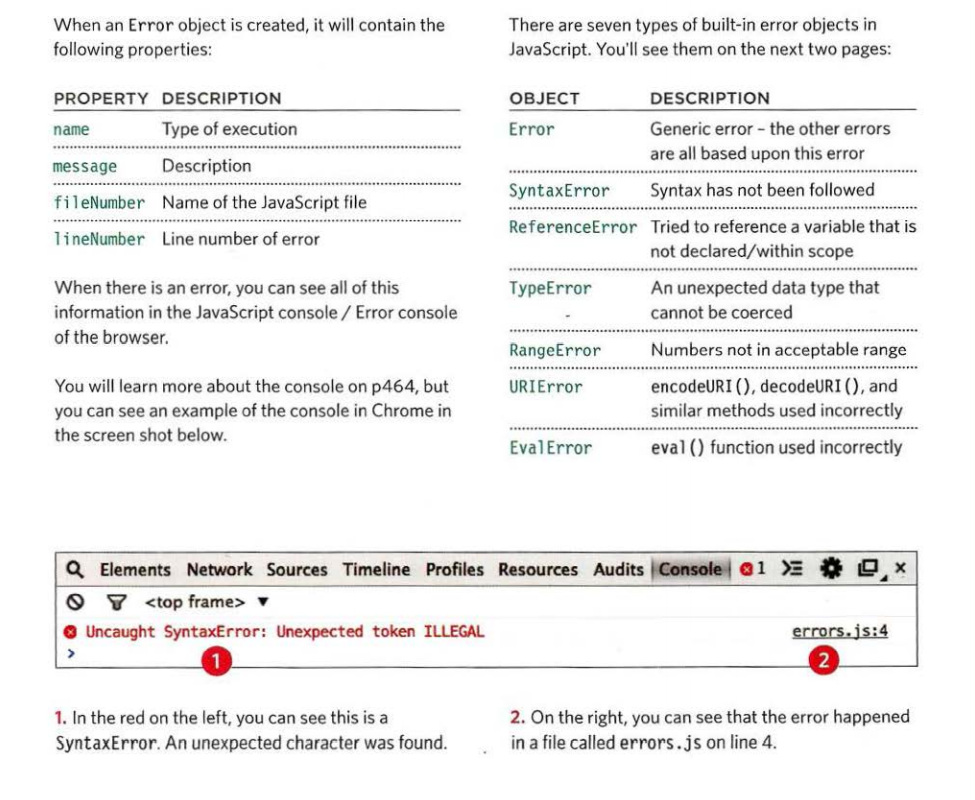
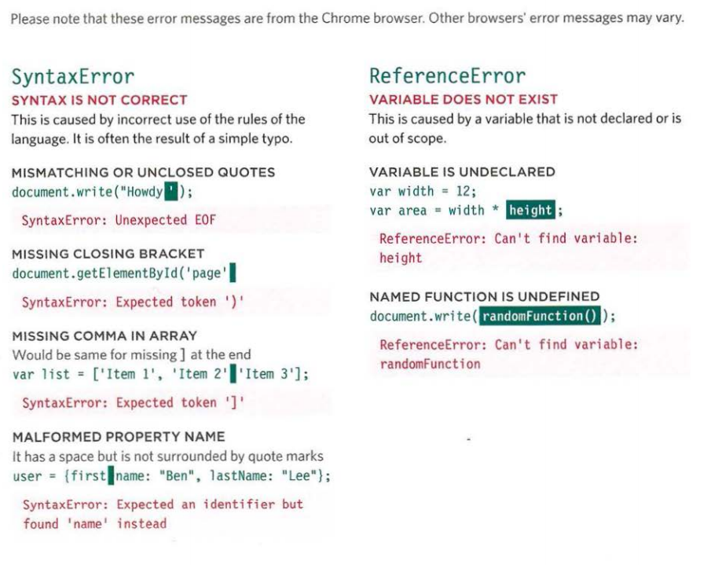
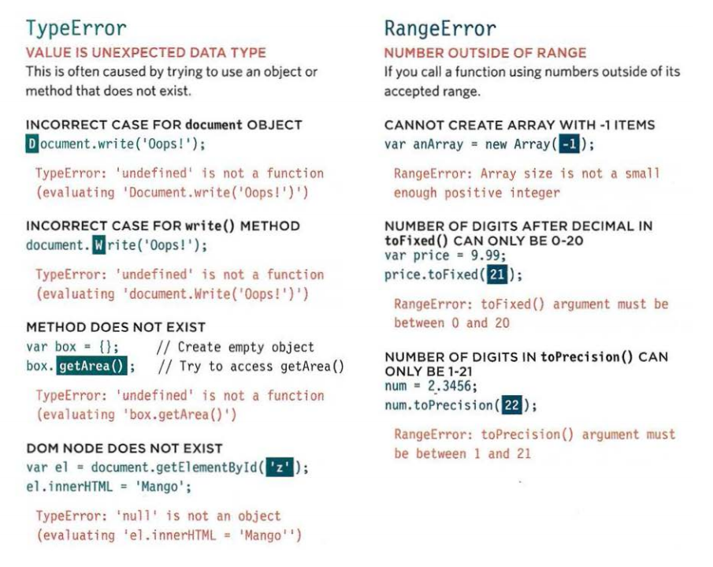
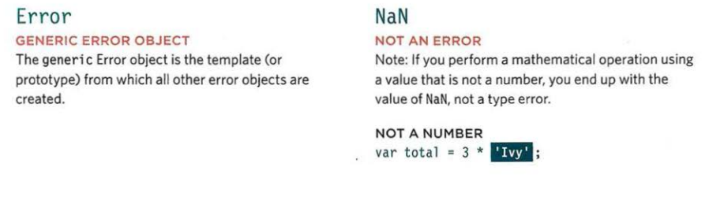
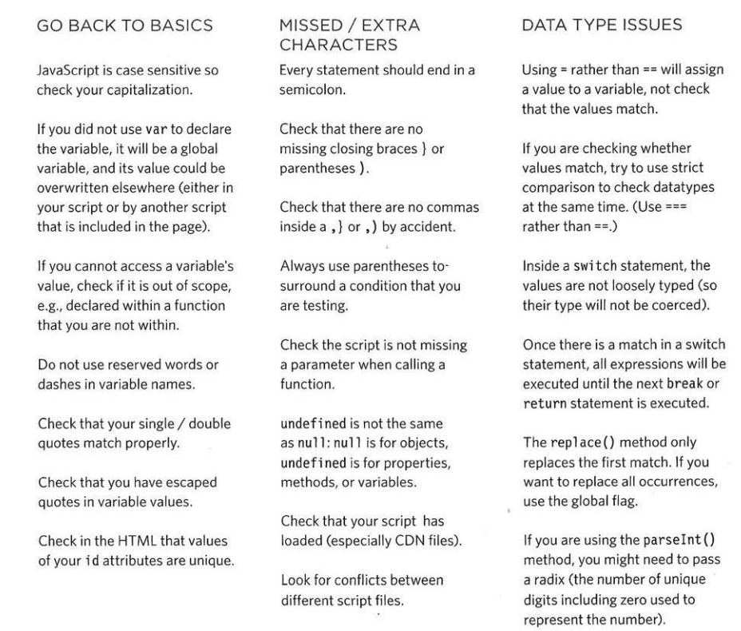

# Duckett JS: 

### Chapter 10: Error Handling & Debugging 

**Execution Context**: in JS there is only one global execution context, and each function we have will create a new execution context which correspond to variable scope.  

The JS interpreter process one line of coding at a time. And if any statement needs data from another function, then it stacks the new function above (on top) the current task.

There are two phases of activity for each new execution context: 
 -	Prepare
 -	Execute

The hoisting is a JavaScript mechanism where variables and function declarations are moved to the top of their scope before code execution.

**Error Objects**: used to find the mistakes, and browsers have tools to read them

  

  

  

  

**Debugging is about deduction**: eliminating potential causes of an error.

**Logging data to console**: the “**console.log()**” mainly used to check if the script is running and if there is any issue or error with the code.

Other methods for console: 
 -	**console.info()**: used for general information
 -	**console.warn()**: used for warnings
 -	**console.error()**: used to hold errors

Also we have the “**console.group()**” used to write set of related data. The after we finish from writing out what we want we add “**console.groupEnd()**” to indicate the end of the group.

In certain browsers, it supports the “console.table()” which will display:
 -	objects
 -	arrays that contain other objects or arrays
	

I can use the “**console. assert()**” method to test if a condition is met, and write to the console only if the expression evaluates to false.

**Breakpoints**: used to pause the execution of a script on any line using breakpoints. The to check the values stored in variables at that point in time.

**Conditional Breakpoints**:  to indicate that a breakpoint should be triggered only if a condition that you specify is met.

A breakpoint can be created using the keyword “**debugger**”. Also it can be placed “**the debugger**” keyword within a conditional statement so that it only triggers the breakpoint if the condition is met. And remember to remove these statements so the page does not stop running.

**Handling Exceptions**: using the “try, catch, finally” method
 -	**try**: I place the code which might have an exception within. And if the exception occured the code will be passed to the catch block 
 -	**catch**: it has one parameter which is the “error object”. Although it is optional, you are not handling the error if you do not catch an error. 
 -	**finally**: The contents of the finally code block will run either way - whether the try block succeeded or failed. It even runs if a return keyword is used in the try or catch block.

**Throwing errors**: I can generate my own errors before the interpreter creates them, if something might cause a problem for the script. 

Using “**throw new Error*(‘ message ‘)**;” to create the error. This creates a new Error object (using the default Error object). The parameter is the message you want associated with the error. This message should be as descriptive as possible.

**Common Errors**:

