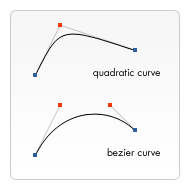

## EASILY CREATE STUNNING ANIMATED CHARTS WITH CHART.JS:

Charts is more preferred to use than tables because:
 -	Better for displaying data visually
 -	It will not be ever going to press-gang them into use as a layout tool.
 -	Easier to look at and convey data quickly

But as for one disadvantage that they are not easy to create.

The steps of creating Chart.JS of three different types: 
 -	Line chart
 -	Pie chart
 -	Bar chart

Steps for all of them: 
 1-	Set up the chart.js and download it
 2-	Add to the HTML page the canvas element and specify for each one of them.
 3-	Writing the script for each one  

## Basic usage of Canvas: 

The **< canvas>** element is almost like the < img> element, but the difference is the < canvas> element does not have the “src” and “alt” attributes. It has the “width” & “height” attirbutes but they are optional to use. 

Also, it is preferred to use the “id” attribute because this makes it much easier to identify it in a script.  The < canvas> element can be styled just like any normal image (margin, border, background…). These rules, however, don't affect the actual drawing on the canvas.

For the < canvas> element we need to sue fallback content because old browsers do not support the < canvas>, and for that we provide fallback content to be displayed by those browsers.

As result for using the fallback content, the < /canvas> closing tag is required and must be written to show the fallback.

**Rendering the context**: the < canvas> is empty, and to display something, a script first needs to access the rendering context and draw on it. The **< canvas>** element has a method called “**getContext()**”, used to obtain the rendering context and its drawing functions. The “**getContext()**” takes one parameter, the type of context.

## Drawing shapes with canvas

**The grid (coordinate space)**: in the gird 1 unit correspond to 1 pixel on the canvas. The origin of the grid is positioned to the top left corner at coordinate (0,0). All elements are placed relative to this origin

**Drawing rectangles**:  The < canvas> only supports two primitive shapes: rectangles and paths (lists of points connected by lines). All other shapes must be created by combining one or more paths. We have assortment of path drawing functions which make it possible to compose very complex shapes.

Three functions that draw rectangles on the canvas:
 -	**fillRect(x, y, width, height)**: Draws a filled rectangle.
 -	**strokeRect(x, y, width, height)**: Draws a rectangular outline.
 -	**clearRect(x, y, width, height)**: Clears the specified rectangular area, making it fully transparent.

**Drawing paths**: A path is a list of points, connected by segments of lines that can be of different shapes, curved or not, of different width and of different color. The path or subpath can be closed.	

To make shapes using paths, we make an additional extra steps:
  1-	First, you create the path.
  2-	Then you use drawing commands to draw into the path.
  3-	Once the path has been created, you can stroke or fill the path to render it.

Functions used to perform these steps:
 -	**beginPath()**: Creates a new path. Once created, future drawing commands are directed into the path and used to build the path up.

 -	**closePath()**: Adds a straight line to the path, going to the start of the current sub-path.

 -	**stroke()**: Draws the shape by stroking its outline.

 -	**fill()**: Draws a solid shape by filling the path's content area.

- The first step to create a path is to call the **beginPath()**. 
- The second step is calling the methods that actually specify the paths to be drawn. 
- The third, and an optional step, is to call **closePath()**. 

This method tries to close the shape by drawing a straight line from the current point to the start.

**Moving the pen**: the **moveTo()** function. The best think of this as lifting a pen or pencil from one spot on a piece of paper and placing it on the next.

**moveTo(x, y)**: Moves the pen to the coordinates specified by x and y.

**Lines**: to draw straight lines use **lineTo()** method.  
**lineTo(x, y)**: Draws a line from the current drawing position to the position specified by x and y.

**Arcs**: To draw arcs or circles, we use the **arc()** or **arcTo()** methods.

**arc(x, y, radius, startAngle, endAngle, counterclockwise)**: Draws an arc which is centered at (x, y) position with radius r starting at startAngle and ending at endAngle going in the given direction indicated by counterclockwise
  The **startAngle** and **endAngle** parameters define the start and end points of the arc in radians, along the curve of the circle, and measured from the x axis.

- Note: . To convert degrees to radians you can use the following JavaScript expression: radians = (Math.PI/180)*degrees

  The **counterclockwise** parameter is a Boolean value which, when true, draws the arc counterclockwise

**rcTo(x1, y1, x2, y2, radius)**: Draws an arc with the given control points and radius, connected to the previous point by a straight line

**Bezier and quadratic curves**: available in both *cubic and quadratic* varieties

**quadraticCurveTo(cp1x, cp1y, x, y)**: Draws a quadratic Bézier curve from the current pen position to the end point specified by x and y, using the control point specified by cp1x and cp1y.

**bezierCurveTo(cp1x, cp1y, cp2x, cp2y, x, y)**: Draws a cubic Bézier curve from the current pen position to the end point specified by x and y, using the control points specified by (cp1x, cp1y) and (cp2x, cp2y).

The difference between the two is a quadratic Bézier curve has a start and an end point (blue dots) and just one control point (indicated by the red dot) while a cubic Bézier curve uses two control points.

**Rectangles**: In addition to the pervious method of drawing rectangles, we can use also the **rect()** method, which adds a rectangular path to a currently open path.

**rect(x, y, width, height)**: Draws a rectangle whose top-left corner is specified by (x, y) with the specified width and height.

**Path2D objects**: to simplify the code and to improve performance, the Path2D object, available in recent versions of browsers, lets you cache or record these drawing commands. You are able to play back your paths quickly.

**Path2D()**: The **Path2D() constructor** returns a newly instantiated Path2D object, optionally with another path as an argument (creates a copy) 

The Path2D API also adds a way to combine paths using the addPath method. This can be useful when you want to build objects from several components.

## Applying styles and colors:

**Colors**: there are two important properties we can use: fillStyle and strokeStyle.

 -	**fillStyle = color**

   Sets the style used when filling shapes.

 -	**strokeStyle = color**

   Sets the style for shapes' outlines.

Note: When you set the strokeStyle and/or fillStyle property, the new value becomes the default for all shapes being drawn from then on. For every shape you want in a different color, you will need to reassign the fillStyle or strokeStyle property.

**Transparency**: We can draw semi-transparent (or translucent) shapes. This is done by either setting the globalAlpha property or by assigning a semi-transparent color to the stroke and/or fill style.

 -	**globalAlpha = transparencyValue**: Applies the specified transparency value to all future shapes drawn on the canvas. The value must be between 0.0 (fully transparent) to 1.0 (fully opaque). This value is 1.0 (fully opaque) by default.

 -	**the strokeStyle and fillStyle properties accept CSS rgba color values**, we can use the following notation to assign a transparent color to them.

**Line styles**: There are several properties which allow us to style lines.
 
 -	**lineWidth = value**

       Sets the width of lines drawn in the future.

 -	**lineCap = type**

       Sets the appearance of the ends of lines. There are three possible values for this property: 

 - **butt**: The ends of lines are squared off at the endpoints.

 -**round**: The ends of lines are rounded.

 -**square**: The ends of lines are squared off by adding a box with an equal width and half the height of the line's thickness.

      And the default this property is set to butt

  -	**lineJoin = type**
 
      Sets the appearance of the "corners" where lines meet. Three possible values for this property:

 - **round**: Rounds off the corners of a shape by filling an additional sector of disc centered at the common endpoint of connected segments. The radius for these rounded corners is equal to half the line width.

 - **bevel**: Fills an additional triangular area between the common endpoint of connected segments, and the separate outside rectangular corners of each segment.

 -**mite**: Connected segments are joined by extending their outside edges to connect at a single point, with the effect of filling an additional lozenge-shaped area. This setting is effected by the miterLimit property which is explained below.

And the default this property is set to miter

 -	**miterLimit = value**

     Establishes a limit on the miter when two lines join at a sharp angle, to let you control how thick the junction becomes.

 -	**getLineDash()**

Returns the current line dash pattern array containing an even number of non-negative numbers.miterLimit = value

 -	**setLineDash(segments)**

     Sets the current line dash pattern.

 -	**line**DashOffset = value**

      Specifies where to start a dash array on a line.

**Gradients**: we can fill and stroke shapes using **linear, radial and conic gradients**. We create a CanvasGradient object by using one of the following methods. We can then assign this object to the fillStyle or strokeStyle properties.

 -	**createLinearGradient(x1, y1, x2, y2)**
     Creates a linear gradient object with a starting point of (x1, y1) and an end point of (x2, y2).

 -	**createRadialGradient(x1, y1, r1, x2, y2, r2)**
     Creates a radial gradient. The parameters represent two circles, one with its center at (x1, y1) and a radius of r1, and the other with its center at (x2, y2) with a radius of r2.

 -	**createConicGradient(angle, x, y)**
      Creates a conic gradient object with a starting angle of angle in radians, at the position (x, y).

We can assign colors to **CanvasGradient** by using the **addColorStop()** method.

**gradient.addColorStop(position, color)**: Creates a new color stop on the gradient object. The position is a number between 0.0 and 1.0 and defines the relative position of the color in the gradient, and the color argument must be a string representing a CSS < color>, indicating the color the gradient should reach at that offset into the transition.

**Patterns**: 

createPattern(image, type)
Creates and returns a new canvas pattern object. image is a CanvasImageSource (that is, an HTMLImageElement, another canvas, a < video> element, or the like. type is a string indicating how to use the image.

The type specifies how to use the image in order to create the pattern, type specifies how to use the image in order to create the pattern

 -	**repeat**
     Tiles the image in both vertical and horizontal directions.

 -	**repeat-x**
      Tiles the image horizontally but not vertically.

 -	**repeat-y**
     Tiles the image vertically but not horizontally.

 -	**no-repeat**
     Doesn't tile the image. It's used only once.

This method is used to create a canvasPattern which similar to the gradient method.

**Shadows**: has four properties:
 
 1-	**shadowOffsetX = float**

       Indicates the horizontal distance the shadow should extend from the object. This value isn't affected by the transformation matrix. The default is 0.

 2-	**shadowOffsetY = float**

      Indicates the vertical distance the shadow should extend from the object. This value isn't affected by the transformation matrix. The default is 0.

 3-	**shadowBlur = float**

      Indicates the size of the blurring effect; this value doesn't correspond to a number of pixels and is not affected by the current transformation matrix. The default value is 0.

 4-	**shadowColor = color**

      A standard CSS color value indicating the color of the shadow effect; by default, it is fully-transparent black

As for **shadowOffsetX & shadowOffsetX** use negative values to cause the shadow to extend up or to the left, and positive values to cause the shadow to extend down or to the right. These are both 0 by default.

**Canvas fill rules**: When using fill (or clip and isPointInPath) you can optionally provide a fill rule algorithm by which to determine if a point is inside or outside a path and thus if it gets filled or not. This is useful when a path intersects itself or is nested.

Two values are possible:
 -	"nonzero":
 -	“evenodd”

**Drawing Text**:

Canvas rendering context provides two methods to render text:

 1-	**fillText(text, x, y [, maxWidth])**: Fills a given text at the given (x,y) position. Optionally with a maximum width to draw.

 2-	**strokeText(text, x, y [, maxWidth])**: Strokes a given text at the given (x,y) position. Optionally with a maximum width to draw.

**Styling text**: There are some more properties which let you adjust the way the text gets displayed on the canvas:
 -	**font = value**

 -	**textAlign = value**

      Text alignment setting. Possible values: start, end, left, right or center. The default value is start.

 -	**textBaseline = value**

      Baseline alignment setting. Possible values: top, hanging, middle, alphabetic, ideographic, bottom. The default value is alphabetic.

 -	**direction = value**

      Directionality. Possible values: ltr, rtl, inherit. The default value is inherit.

**Advanced text measurements**: 
measureText(): Returns a TextMetrics object containing the width, in pixels, that the specified text will be when drawn in the current text style.
