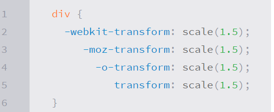
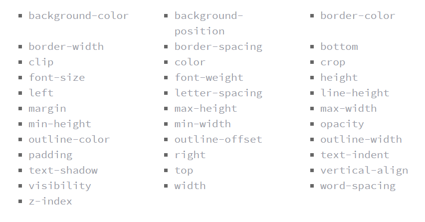
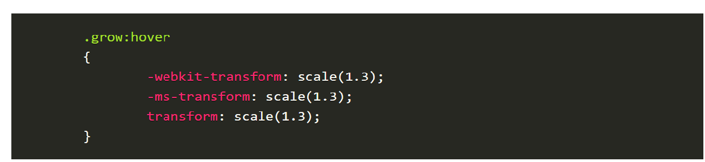
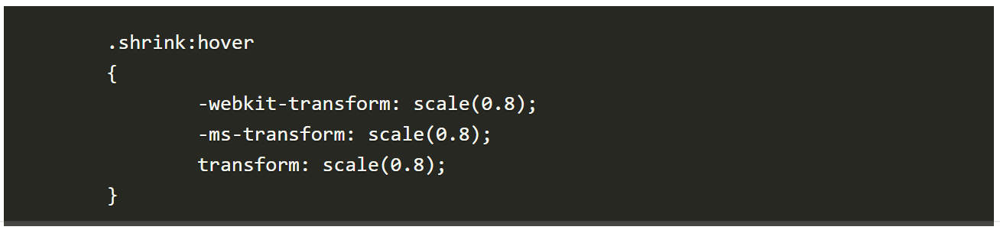
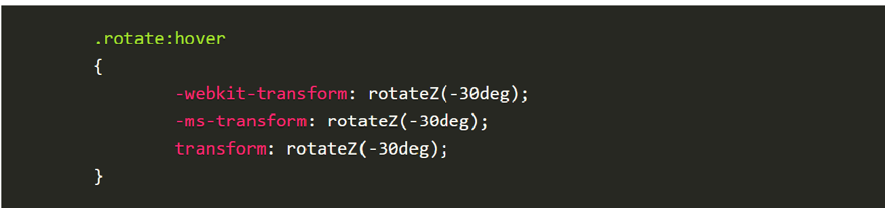
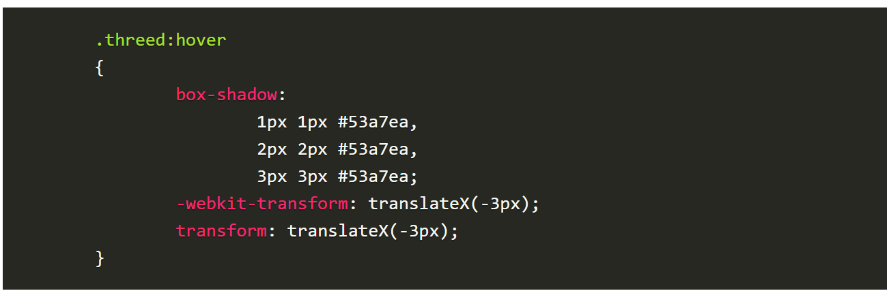
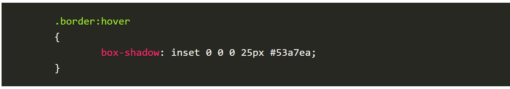

# CSS Transform

The **transform property** comes in two different settings, *two-dimensional* and *three-dimensional*. Each of these come with their own individual properties and values.

### Transform Syntax

The transform property followed by the value. The value specifies the transform type followed by a specific amount inside parentheses.

Notice how the transform property includes multiple vendor prefixes to gain the best support across all browsers. The un-prefixed declaration comes last to overwrite the prefixed versions, should a browser fully support the transform property.

### 2D Transforms

 - **2D Rotate**: The rotate value provides the ability to rotate an element from 0 to 360 degrees. Using a positive value will rotate an element clockwise, and using a negative value will rotate the element counterclockwise.

 - **2D Scale**: Using the scale value within the transform property allows you to change the appeared size of an element. The default scale value is 1. And it is possible to scale only the height or width of an element using the scaleX and scaleY values. The scaleX value will scale the width of an element while the scaleY value will scale the height of an element

 - **2D Translate**: The translate value works a bit like that of relative positioning, pushing and pulling an element in different directions without interrupting the normal flow of the document. Using the translateX value will change the position of an element on the horizontal axis while using the translateY value will change the position of an element on the vertical axis. Positive values will push an element down and to the right of its default position while negative values will pull an element up and to the left of its default position.

 - **2D Skew**: The value skew for transform used to distort elements on the horizontal axis, vertical axis, or both. Using the skewX value distorts an element on the horizontal axis while the skewY value distorts an element on the vertical axis. And to distort an element on both axes the skew value is used, declaring the x axis value first, followed by a comma, and then the y axis value

### Combining Transforms#combining-transforms

To combine transforms, list the transform values within the transform property one after the other without the use of commas.

### Transform Origin
 
 The default transform origin is the dead center of an element, both 50% horizontally and 50% vertically.
 The **transform-origin** property can accept one or two values. When only one value is specified, that value is used for both the horizontal and vertical axes. If two values are specified, the first is used for the horizontal axis and the second is used for the vertical axis. 

The values 0 0 is the same value as top left, and 100% 100% is the same value as bottom right.

### Perspective

The perspective for each element can be thought of as a vanishing point.  

The perspective of an element can be set in two different ways. One way includes using the perspective value within the transform property on individual elements, while the other includes using the perspective property on the parent element residing over child elements being transformed.

Using the perspective value within the transform property works great for transforming one element from a single.

to transform a group of elements all with the same perspective, apply the perspective property to their parent element.

### Perspective Depth Value

The perspective value can be set as none or a length measurement. The **none** value turns off any perspective, while the length value will set the depth of the perspective. *The higher the value,* the further away the perspective appears, thus creating a fairly low intensity perspective and a small three-dimensional change. The *lower the value* the closer the perspective appears, thus creating a high intensity perspective and a large three-dimensional change.

### Perspective Origin

The same values used for the **transform-origin** property may also be used with the **perspective-origin** property

The large difference between the two falls where the origin of a transform determines the coordinates used to calculate the change of a transform, while the origin of a perspective identifies the coordinates of the vanishing point of a transform.

### 3D Transforms

 - **3D Rotate**: With three-dimensional transforms we can rotate an element around any axes. The three new transform values, including rotateX, rotateY, and rotateZ.

 - **3D Scale**: using the scaleZ three-dimensional transform elements may be scaled on the z axis.And the rotateX value is added in order to see the behavior of the scaleZ value. 

 - **3D Translate**: using the translateZ value with a negative value here will push an element further away on the z axis, resulting in a smaller element. Using a positive value will pull an element closer on the z axis, resulting in a larger element.

 - **3D Skew**: skew is the one two-dimensional transform that cannot be transformed on a three-dimensional scale

 - **Shorthand 3D Transforms**:  there are  properties to write out shorthand three-dimensional transform. These properties include rotate3d, scale3d, transition3d, and matrix3d. 

### Transform Style

Three-dimensional transforms will be applied on an element that is nested within a parent element which is also being transformed. 

In this event, the nested, transformed elements will not appear in their own three-dimensional space. To allow nested elements to transform in their own three-dimensional plane use the transform-style property with the preserve-3d value.

### Backface Visibility#backface-visibility

set the **backface-visibility** property to *hidden*, and you will hide the element whenever it is facing away from the screen.

The other value to **backface-visibility** is *visible* which is the default value, always displaying an element, no matter which direction it faces.

# Transitions & Animations

Animations within CSS3 allow the appearance and behavior of an element to be altered in multiple keyframes. Transitions provide a change from one state to another, while animations can set multiple points of transition upon different keyframes.

### Transitions

For a transition to take place, an element must have a change in state, and different styles must be identified for each state. The easiest way for determining styles for different states is by using the **:hover**, **:focus**, **:active**, and **:target** pseudo-classes. 

There are four transition related properties in total, including **transition-propert**, **transition-duration**, **transition-timing-function**, and **transition-delay**. Not all of these are required to build a transition, with the first three are the most popular.

### Transitional Property

The transition-property property determines exactly what properties will be altered in conjunction with the other transitional properties. By default, all of the properties within an element’s different states will be altered upon change. However, only the properties identified within the transition-property value will be affected by any transitions. 

If multiple properties need to be transitioned they may be comma separated within the transition-property value. Additionally, the keyword value all may be used to transition all properties of an element.

### Transitional Properties

It is important to note, not all properties may be transitioned, only properties that have an identifiable halfway point.

A handful of the more popular transitional properties include the following.

### Transition Duration

The duration in which a transition takes place is set using the transition-duration property. The value of this property can be set using general timing values, including seconds (s) and milliseconds (ms). 

When transitioning multiple properties you can set multiple durations, one for each property. As with the transition-property property value, multiple durations can be declared using comma separated values. The order of these values when identifying individual properties and durations does matter.

### Transition Timing

The transition-timing-function property is used to set the speed in which a transition will move.     

A few of the more popular keyword values for the transition-timing-function property include linear, ease-in, ease-out, and ease-in-out.

 - The **linear** keyword value identifies a transition moving in a constant speed from one state to another. 
 - The **ease-in** value identifies a transition that starts slowly and speeds up throughout the transition
 - The **ease-out** value identifies a transition that starts quickly and slows down throughout the transition. 
 - The **ease-in-out** value identifies a transition that starts slowly, speeds up in the middle, then slows down again before ending.

### Transition Delay

The delay sets a time value, seconds or milliseconds, that determines how long a transition should be stalled before executing. 

To delay numerous transitions, each delay can be declared as comma separated values.

### Shorthand Transitions

Shorthand property, transition, capable of supporting all of these different properties and values.

Using the transition value alone, you can set every transition value in the order of transition-property, transition-duration, transition-timing-function, and lastly transition-delay. 

Do not use commas with these values unless you are identifying numerous transitions

To set numerous transitions at once, set each individual group of transition values, then use a comma to separate each additional group of transition values.

## Animations

### Animations Keyframes

To set multiple points at which an element should undergo a transition, use the **@keyframes** rule. The @keyframes rule includes the animation name, any animation breakpoints, and the properties intended to be animated.

### Animation Name

To assign an element the animation-name property is used with the animation name, identified from the @keyframes rule, as the property value

### Animation Duration, Timing Function, & Delay

Animations include a duration, timing function, and delay if desired. To start, animations need a duration declared using the **animation-duration** property. 

A timing function and delay can be declared using the **animation-timing-function** and **animation-delay** properties respectively.

## Customizing Animations

### Animation Iteration

To have an animation repeat itself numerous times the animation-iteration-count property may be used. The values of the property include either an **integer** or the **infinite** keyword. 

Using an integer will repeat the animation as many times as specified, while the infinite keyword will repeat the animation indefinitely in a never ending fashion.

### Animation Direction

To declare the direction an animation completes using the **animation-direction** property. Values for the animation-direction property include **normal**, **reverse**, **alternate**, and **alternate-reverse**.

 - The **normal** value plays an animation as intended from beginning to end 
 - The **reverse** value will play the animation exactly opposite as identified within the @keyframes rule, thus starting at 100% and working backwards to 0%.
 - The **alternate value** will play an animation forwards then backwards.
 - The **alternate-reverse** value combines both the alternate and reverse values, running an animation backwards then forwards. The alternate-reverse value starts at 100% running to 0% and then back to 100% again.

### Animation Play State

The animation-play-state property allows an animation to be played or paused using the **running** and **paused** keyword values respectively. When you play a paused animation, it will resume running from its current state rather than starting from the very beginning again.

### Animation Fill Mode

The animation-fill-mode property identifies how an element should be styled either before, after, or before and after an animation is run. The animation-fill-mode property accepts four keyword values, including **none**, **forwards**, **backwards**, and **both**.

 - The none value will not apply any styles to an element before or after an animation has been run.

 - The forwards value will keep the styles declared within the last specified keyframe.

 - The backwards value will apply the styles within the first specified keyframe as soon as being identified, before the animation has been run
 
 - The both value will apply the behaviors from both the forwards and backwards values.

### Shorthand Animations

Fortunately animations, just like transitions, can be written out in a shorthand format. This is accomplished with one animation property

**The order of values within the animation property should be animation-name, animation-duration, animation-timing-function, animation-delay, animation-iteration-count, animation-direction, animation-fill-mode, and lastly animation-play-state.**

# 8 SIMPLE CSS3 TRANSITIONS THAT WILL WOW YOUR USERS

### 1. Fade in

It is a great way to emphasize functionality or draw attention to a call to action.

Fade in effects are coded in two steps: first, you set the initial state; next, you set the change.

### 2. Change color

ALl we need is to specify the color we want in our CSS

### 3. Grow & Shrink

Use CSS3’s **transform** to enlarge. To enlarge an element we specify a value greater than 1, to shrink it, we specify a value less than 1:

### 4. Rotate elements

### 5. Square to circle
 
 The transition is done by the **border-radius** property.

### 6. 3D shadow

chieved by adding a box shadow, and then moving the element on the x axis using the transform and translate properties so that it appears to grow out of the screen

### 7. Swing

Not all elements use the transition property. We can also create highly complex animations using @keyframes, animation and animation-iteration.

### 8. Inset border

The ghost button; a button with no background and a heavy border. 

### References: 
 1- [CSS Transform](https://learn.shayhowe.com/advanced-html-css/css-transforms/)  
 2- [Transitions & Animations](https://learn.shayhowe.com/advanced-html-css/transitions-animations/)  
 3-[8 SIMPLE CSS3 TRANSITIONS THAT WILL WOW YOUR USERS](https://www.webdesignerdepot.com/2014/05/8-simple-css3-transitions-that-will-wow-your-users)