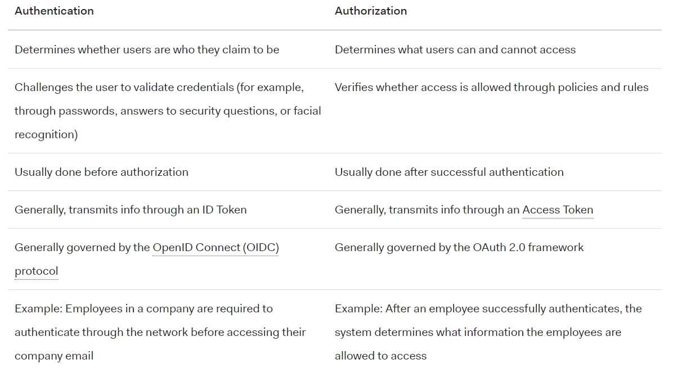

## What is OAuth

**OAuth definition**

OAuth is an open-standard authorization protocol or framework that describes how unrelated servers and services can safely allow authenticated access to their assets without actually sharing the initial, related, single logon credential. In authentication parlance, this is known as secure, third-party, user-agent, delegated authorization.

**OAuth examples**

The simplest example of OAuth is when you go to log onto a website and it offers one or more opportunities to log on using another website’s/service’s logon. You then click on the button linked to the other website, the other website authenticates you, and the website you were originally connecting to logs you on itself afterward using permission gained from the second website.

Another example OAuth scenario could be a user sending cloud-stored files to another user via email, when the cloud storage and email systems are otherwise unrelated other than supporting the OAuth framework. When the end-user attaches the files to their email and browses to select the files to attach, OAuth could be used behind the scenes to allow the email system to seamlessly authenticate and browse to the protected files without requiring a second logon to the file storage system
In all cases, two or more services are being used for one transaction by the end-user, and every end-user would appreciate not being asked to log in a second time for what they feel is a single transaction. For OAuth to work, the end-user’s client software (e.g., a browser), the services involved and authentication provider must support the right version of OAuth

**OAuth explained**
It is helpful to remember that OAuth is about authorization in particular and not directly about authentication.

- Authentication is the process of a user/subject proving its ownership of a presented identity, by providing a password or some other uniquely owned or presented factor. 

- Authorization is the process of letting a subject access resources after a successful authentication, oftentimes somewhere else.
Many people think that OAuth stands for open authentication, but it’s more helpful to understand it by thinking about it as open AUTHorization.

An early implementer describes OAuth as similar to a car’s valet key, which can be used to allow a valet to temporarily drive and park a car, but it doesn’t allow the holder full, unlimited access like a regular key. Instead the car can only be driven a few miles, can’t access the trunk or locked glove box, and can have many other limitations. OAuth essentially allows the user, via an authentication provider that they have previously successfully authenticated with, to give another website/service a limited access authentication token for authorization to additional resources.

**How OAuth works**
 
 1-	The first website connects to the second website on behalf of the user, using OAuth, providing the user’s verified identity.

 2-	The second site generates a one-time token and a one-time secret unique to the transaction and parties involved.

 3-	The first site gives this token and secret to the initiating user’s client software.

 4-	The client’s software presents the request token and secret to their authorization provider (which may or may not be the second site).

 5-	If not already authenticated to the authorization provider, the client may be asked to authenticate. After authentication, the client is asked to approve the authorization transaction to the second website.

 6-	The user approves (or their software silently approves) a particular transaction type at the first website.

 7-	 The user is given an approved access token (notice it’s no longer a request token).

 8-	The user gives the approved access token to the first website.

 9-	The first website gives the access token to the second website as proof of authentication on behalf of the user.

 10-	The second website lets the first website access their site on behalf of the user.

 11-	The user sees a successfully completed transaction occurring.

 12-	OAuth is not the first authentication/authorization system to work this way on behalf of the end-user. In fact, many authentication systems, notably Kerberos, work similarly. What is special about OAuth is its ability to work across the web and its wide adoption. It succeeded with adoption rates where previous attempts failed (for various reasons).

**OAuth vs. OpenID**

OpenID is about authentication, unlike OAuth stood for authorization

Q1) What is OAuth? 

OAuth is an open-standard authorization protocol or framework that describes how unrelated servers and services can safely allow authenticated access to their assets without actually sharing the initial, related, single logon credential.

Q2) Give an example of what using OAuth would look like. 

One of the examples is when you go to log onto a website and it offers one or more opportunities to log on using another website’s/service’s logon. You then click on the button linked to the other website, the other website authenticates you, and the website you were originally connecting to logs you on itself afterward using permission gained from the second website.

Q3) How does OAuth work? What are the steps that it takes to authenticate the user?

1-	The first website connects to the second website on behalf of the user, using OAuth, providing the user’s verified identity.

2-	The second site generates a one-time token and a one-time secret unique to the transaction and parties involved.

3-	The first site gives this token and secret to the initiating user’s client software.

4-	The client’s software presents the request token and secret to their authorization provider (which may or may not be the second site).

5-	If not already authenticated to the authorization provider, the client may be asked to authenticate. After authentication, the client is asked to approve the authorization transaction to the second website.

6-	The user approves (or their software silently approves) a particular transaction type at the first website.

7-	 The user is given an approved access token (notice it’s no longer a request token).

8-	The user gives the approved access token to the first website.

9-	The first website gives the access token to the second website as proof of authentication on behalf of the user.

10-	The second website lets the first website access their site on behalf of the user.

11-	The user sees a successfully completed transaction occurring.

12-	OAuth is not the first authentication/authorization system to work this way on behalf of the end-user. In fact, many authentication systems, notably Kerberos, work similarly. What is special about OAuth is its ability to work across the web and its wide adoption. It succeeded with adoption rates where previous attempts failed (for various reasons).

Q4) What is OpenID?

OpenID is like authentication protocol 

## Authorization and Authentication flows

Q1) What is the difference between authorization and authentication?

Q2) What is Authorization Code Flow?

It is an exchanges an Authorization Code for a token. 
The authorization code grant type is used to obtain both access tokens and refresh tokens and is optimized for confidential clients.

Q3) What is Authorization Code Flow with Proof Key for Code Exchange (PKCE)?

It is an Authorization almost the same as the Authorization Code Flow, but it requires an additional security.

Q4) What is Implicit Flow with Form Post?

It is an Authorization  intended for Public Clients, or applications which are unable to securely store Client Secrets

Q5) What is Client Credentials Flow?
It is an Authorization where the system authenticates and authorizes the app rather than a user

Q6) What is Device Authorization Flow?

It is an Authorization where rather than authenticate the user directly, the device asks the user to go to a link on their computer or smartphone and authorize the device. This avoids a poor user experience for devices that do not have an easy way to enter text.

Q7) What is Resource Owner Password Flow?

It is an Authorization that requests that users provide credentials (username and password), typically using an interactive form.

**Resources**: 
 - [What is OAuth](https://www.csoonline.com/article/3216404/what-is-oauth-how-the-open-authorization-framework-works.html)

 - [Authorization and Authentication flows](https://auth0.com/docs/flows)

