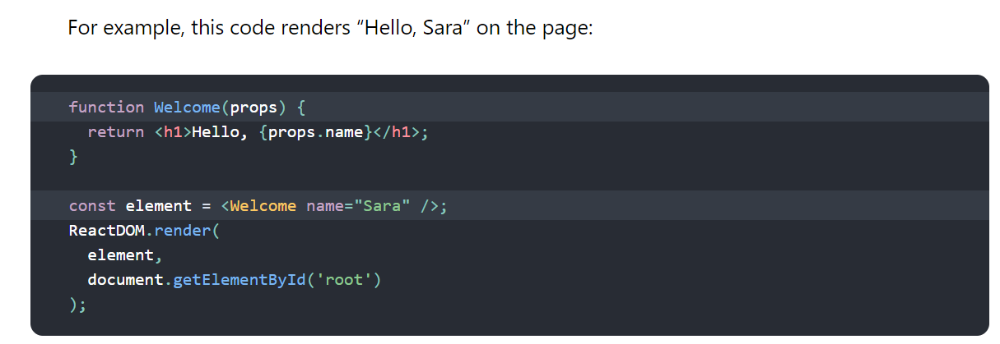

## Component-Based Architecture

Component-based architecture focuses on the decomposition of the design into individual functional or logical components. And provides a higher level of abstraction and divides the problem into sub-problems

The primary objective of component-based architecture is to ensure **component reusability**.

**Component**:  *is a modular, portable, replaceable, and reusable set of well-defined functionality that encapsulates its implementation and exporting it as a higher-level interface.*

It has a defined interface and conforms to a recommended behavior common to all components within an architecture.

A component can have three different views:
 
 - **Object-oriented view**:  component is viewed as a set of one or more cooperating classes. And each problem domain class (analysis) and infrastructure class (design) are explained to identify all attributes and operations that apply to its implementation
 
 - **Conventional view**: the component viewed as a functional element or a module of a program that integrates the processing logic, the internal data structures and an interface
 
 - **Process-related view**: in this view the system is building from existing components maintained in a library.

**Characteristics of Components**:
 - Reusability

 - Replaceable

 - Not context specific

 - Extensible

 - Encapsulated

 - Independent

**Advantages**:
 - Ease of deployment 

 - Reduced cost
 
 - Ease of development
 
 - Reusable
 
 - Modification of technical complexity

 - Reliability

 - System maintenance and evolution

 - Independent

 ## What is “Props” and how to use it in React?

 **React** is a component-based library which divides the UI into little reusable pieces. And the way to pass data between components is by using props.

 “**Props**” is a special keyword in React and it stands for roperties and is being used for *passing data from one component to another*.

 The data with props are being passed in a one-way which is from parent to child (**uni-directional flow**). Also the data coming from the parent should not be changed by child components and this makes the  **props data is read-only**.

 Using Props in React:

 1- *Firstly, define an attribute and its value(data)*: define our own attributes & assign values with interpolation { }

 2- *Pass it to child component(s) by using Props*: Passing props is very simple. Like we pass arguments to a function, we pass props into a React component and props bring all the necessary data.

 3- *Finally, render the Props Data*: render the props object by using string interpolation:

 ## Introducing JSX: 

JSX stands for JavaScript XML. JSX allows us to write HTML in React. JSX makes it easier to write and add HTML in React.

JSX allows us to write HTML elements in JavaScript and place them in the DOM without any createElement()  and/or appendChild() methods.

JSX converts HTML tags into react elements.

React doesn’t require using JSX, but most people find it helpful as a visual aid when working with UI inside the JavaScript code. It also allows React to show more useful error and warning messages.

**Attributes can be specified with JSX**:

- In JSX it is possible to specify Children .

- Also it safe to embed user input in JSX, the JSX prevent injection attacks. 

- And JSX represents objects, these objects are called “React elements”. They can be thought of them as descriptions of what you want to see on the screen. React reads these objects and uses them to construct the DOM and keep it up to date.

## Rendering Elements:

Elements are the smallest building blocks of React apps. The element describes what you will see in the screen.

Unlike browser DOM elements, React elements are plain objects, and are cheap to create. React DOM takes care of updating the DOM to match the React elements.

**Rendering an Element into the DOM**:
To render a React element into a root DOM node, pass both to ReactDOM.render():

**Updating the Rendered Element**:
React elements are immutable. Once you create an element, you can’t change its children or attributes. An element is like a single frame in a movie: it represents the UI at a certain point in time.

## Components and Props

Components let you split the UI into independent, reusable pieces, and think about each piece in isolation.
Conceptually, components are like JavaScript functions. They accept arbitrary inputs (called “props”) and return React elements describing what should appear on the screen.

**Rendering a Component**:
When React sees an element representing a user-defined component, it passes JSX attributes and children to this component as a single object. We call this object “props”.

 

Let’s recap what happens in this example:

1-	We call ReactDOM.render() with the < Welcome name="Sara" /> element. 
2-	React calls the Welcome component with {name: 'Sara'} as the props. 
3-	Our Welcome component returns a < h1>Hello, Sara< /h1> element as the result. 
4-	React DOM efficiently updates the DOM to match < h1>Hello, Sara< /h1>.

**Composing Components**:

Components can refer to other components in their output. This lets us use the same component abstraction for any level of detail. A button, a form, a dialog, a screen: in React apps, all those are commonly expressed as components.

**Props are Read-Only**:

Component as a function or a class, it must never modify its own props.
Such functions are called “pure” because they do not attempt to change their inputs, and always return the same result for the same inputs.
All React components must act like pure functions with respect to their props.

 Resources: 
 - [Component-Based Architecture](https://www.tutorialspoint.com/software_architecture_design/component_based_architecture.htm)

 - [What is “Props” and how to use it in React?](https://itnext.io/what-is-props-and-how-to-use-it-in-react-da307f500da0)

 - [Introducing JSX](https://reactjs.org/docs/introducing-jsx.html)

 - [Rendering Elements](https://reactjs.org/docs/rendering-elements.html)
 
 - [Components and Props](https://reactjs.org/docs/components-and-props.html)
