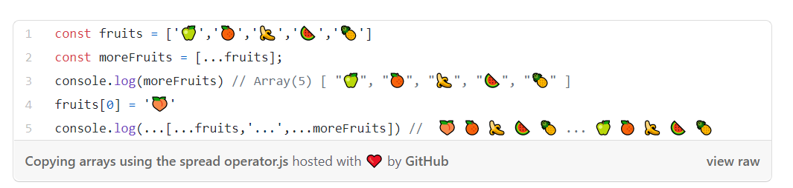
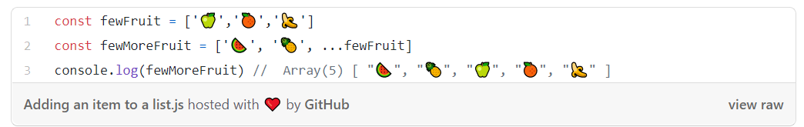
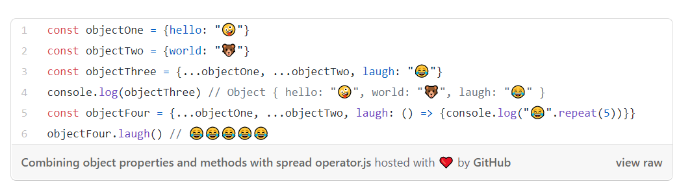

## Lists and Keys

### Keys 

A “**key**" is a special string attribute you need to include when creating lists of elements. 
The importance of Keys is to help React identify which items have changed, are added, or are removed. Keys should be given to the elements inside the array to give the elements a stable identity.

It is not recommend using indexes for keys if the order of items may change. This can negatively impact performance and may cause issues with component state

### Extracting Components with Keys

Keys only make sense in the context of the surrounding array.
For example, if you extract a ListItem component, you should keep the key on the <ListItem /> elements in the array rather than on the < li> element in the ListItem itself.
A good rule of thumb is that elements inside the map() call need keys.

### Keys Must Only Be Unique Among Siblings

Keys used within arrays should be unique among their siblings. However, they don’t need to be globally unique. The same keys can be used when we produce two different arrays.

Keys serve as a hint to React but they don’t get passed to your components. If you need the same value in your component, pass it explicitly as a prop with a different name:

JSX allows embedding any expression in curly braces so we could inline the map() result
 
Q1) What does .map() return?  
A new arrary

Q2) If I want to loop through an array and display each value in JSX, how do I do that in React? 
Using .map()

Q3) Each list item needs a unique ____. 
Key

Q4) What is the purpose of a key? 
The purpose of Keys is to help React identify which items have changed, are added, or are removed.

## The Spread Operator

### What is the spread operator?

In JavaScript, spread syntax refers to the use of an ellipsis of three dots **(…)** to expand an iterable object into the list of arguments.

### What is ... used for?
The spread operator is a useful and quick syntax for **adding items to arrays, combining arrays or objects, and spreading an array out into a function’s arguments.**

### What else can … do?

The … spread operator is useful for many different routine tasks in JavaScript, including the following:

 -	Copying an array
 -	Concatenating or combining arrays
 -	Using Math functions
 -	Using an array as arguments
 -	Adding an item to a list
 -	Adding to state in React
 -	Combining objects
 -	Converting NodeList to an array

**One of the best ways to understand the use of spread operator in JavaScript is to look at the the built-in functions Math.min() and Math.max(), which both expect a list of arguments, not an array.**

### Adding to state in React

Adding an item to an array in React state is easily accomplished using the spread operator.
Combining objects

The spread syntax is useful for combining the properties and methods on objects into a new object

### A note about copying by reference

One of the benefits of using the spread operator is that it will create a new reference to its primitive values, copying them.

**Which means that changes to the original array will not affect the copied array, which is what would happen if the array had been linked to the original with the assignment operator =**

Q1) What is the spread operator?  
spread syntax refers to the use of an ellipsis of three dots (…) to expand an iterable object into the list of arguments.

Q2) List 4 things that the spread operator can do.  
-	Copying an array
-	Concatenating or combining arrays
-	Using Math functions
-	Using an array as arguments

Q3) Give an example of using the spread operator to combine two arrays. 
 

Q4) Give an example of using the spread operator to add a new item to an array. 
 

Q5) Give an example of using the spread operator to combine two objects into one. 
 

### How to Pass Functions Between Components

-	A parent component defines a function
-	The function is passed as a prop to a child component
-	The child component then invokes the prop
-	The parent function is then called, usually changing something
-	Then the parent component is re-rendered along with its children

Q1) In the video, what is the first step that the developer does to pass functions between components?
Creating the function in the parent component and then assign it as props to be passed to the child component. 

Q2) In your own words, what does the increment function do? 
In general, it makes changes when it invoked to UI. For example, it increases the vote or what we select from the items by one. 

Q3) How can you pass a method from a parent component into a child component? 
Just like the props.  methodName/anyName={this.methodName}

Q4) How does the child component invoke a method that was passed to it from a parent component? 
Using the setState , through another merthod

### Resources: 
 - [Lists and Keys](https://reactjs.org/docs/lists-and-keys.html)

 - [The Spread Operator](https://medium.com/coding-at-dawn/how-to-use-the-spread-operator-in-javascript-b9e4a8b06fab)

 - [How to Pass Functions Between Components](https://www.youtube.com/watch?v=c05OL7XbwXU)

