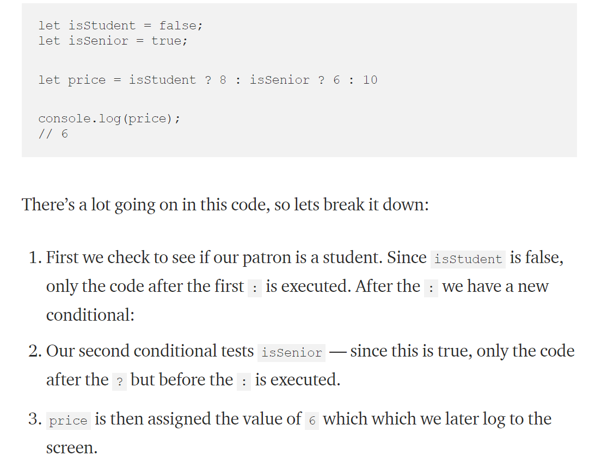
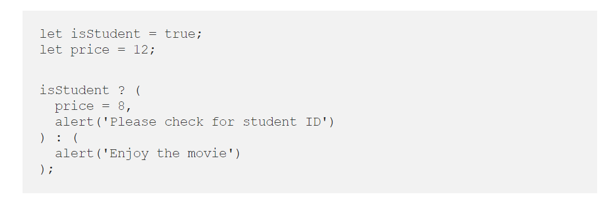

## React Docs - Forms

**Controlled Components**

In HTML, form elements such as < input>, < textarea>, and < select> typically maintain their own state and update it based on user input. In React, mutable state is typically kept in the state property of components, and only updated with setState().

Then combine the two by making the React state be the “single source of truth”. Then the React component that renders a form also controls what happens in that form on subsequent user input

**The textarea Tag**

In HTML, a < textarea> element defines its text by its children.
In React, a < textarea> uses a value attribute instead. This way, a form using a < textarea> can be written very similarly to a form that uses a single-line input

**The select Tag**

In HTML, < select> creates a drop-down list.
React, instead of using this selected attribute, uses a value attribute on the root select tag. This is more convenient in a controlled component because you only need to update it in one place.

**The file input Tag**

In HTML, an < input type="file"> lets the user choose one or more files from their device storage to be uploaded to a server or manipulated by JavaScript via the File API.
Because its value is read-only, it is an uncontrolled component in React.

**Handling Multiple Inputs**

When you need to handle multiple controlled input elements, you can add a name attribute to each element and let the handler function choose what to do based on the value of event.target.name.

**Controlled Input Null Value**

Specifying the value prop on a controlled component prevents the user from changing the input unless you desire so. If you’ve specified a value but the input is still editable, you may have accidentally set value to undefined or null.

Q1) What is a ‘Controlled Component’? 
An input form element whose value is controlled by React

Q2) Should we wait to store the users respones from the form into state when they submit the form OR should we update the state with their responses as soon as they enter them? Why. 
We should update them. Because we do not want to have a fixed value for input

Q3) How do we target what the user is entering if we have an event handler on an input field? 
By using the value attribute to update the state through the handlechange function

## The Conditional (Ternary) Operator Explained

**The Conditional (Ternary) Operator**:

**“condition ? value if true : value if false”**

1-	The condition is what you’re actually testing. The result of your condition should be true or false or at least coerce to either boolean value.
2-	 A ? separates our conditional from our true value. Anything between the ? and the : is what is executed if the condition evaluates to true.
3-	Finally a : colon. If your condition evaluates to false, any code after the colon is executed.

We can nest ternary operators to **test multiple conditions**:

The following example explains:

**Multiple operations:**

It is also possible to run multiple operations within a ternary. To do this, we must separate the operations with a comma. You can also, optionally, use parenthesis to help group your code.

Q1) Why would we use a ternary operator? 
Because it is a shortcut for the “if” statement, which makes the code more cleaner 

Q2) Rewrite the following statement using a ternary statement: 
  if(x===y){
 console.log(true);
  } else {
 console.log(false);
  }
“x ===y ? console.log(true) : console.log(false)”

**Resources:**

 - [React Docs - Forms](https://reactjs.org/docs/forms.html)
 - [The Conditional (Ternary) Operator Explained](https://codeburst.io/javascript-the-conditional-ternary-operator-explained-cac7218beeff)

