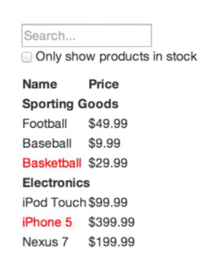
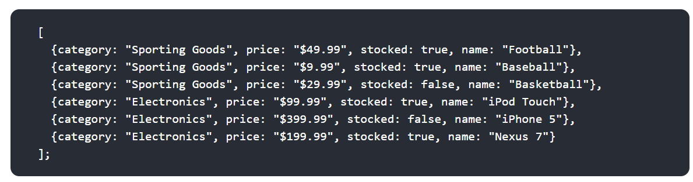
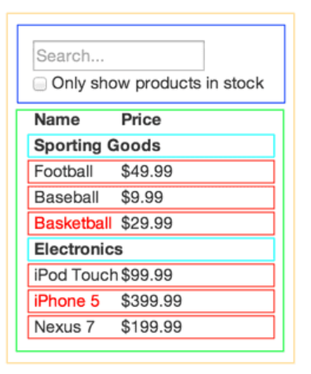
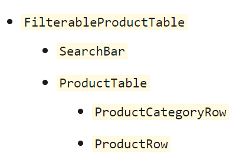

## React Docs - thinking in React

**Start With A Mock**
Imagine that we already have a JSON API and a mock from our designer. The mock looks like this:

JSON API returns some data that looks like this

### Step 1: Break The UI Into A Component Hierarchy

The first thing you’ll want to do is to draw boxes around every component (and subcomponent) in the mock and give them all names.

And to know if it should be its own component is to use technique is the single responsibility principle, that is, a component should ideally only do one thing. If it ends up growing, it should be decomposed into smaller subcomponents.

Since you’re often displaying a JSON data model to a user, you’ll find that if your model was built correctly, your UI (and therefore your component structure) will map nicely. That’s because UI and data models tend to adhere to the same information architecture. Separate your UI into components, where each component matches one piece of your data model.

You’ll see here that we have five components in our app. We’ve italicized the data each component represents.

1-	FilterableProductTable (orange): contains the entirety of the example 
2-	SearchBar (blue): receives all user input 
3-	ProductTable (green): displays and filters the data collection based on user input 
4-	ProductCategoryRow (turquoise): displays a heading for each category 
5-	ProductRow (red): displays a row for each product 

Arranging the components into a hierarchy. Components that appear within another component in the mock should appear as a child in the hierarchy:

### Step 2: Build A Static Version in React

To implement the app. The easiest way is to build a version that takes the data model and renders the UI but has no interactivity. 

It’s best to decouple these processes because building a static version requires a lot of typing and no thinking, and adding interactivity requires a lot of thinking and not a lot of typing.
And the state should not be used at all to build this static version. 

- State is reserved only for interactivity, that is, data that changes over time. Since this is a static version of the app, you don’t need it.

- In simpler examples, it’s usually easier to go top-down, and on larger projects, it’s easier to go bottom-up and write tests as you build.

### Step 3: Identify The Minimal (but complete) Representation Of UI State

To build an app correctly, first you need to think of the minimal set of mutable state that the app needs. The key here is DRY: Don’t Repeat Yourself. Figure out the absolute minimal representation of the state an application needs and compute everything else you need on-demand.

So taking the pervious example: 

Think of all of the pieces of data in our example application. We have:

-	The original list of products 
-	 The search text the user has entered 
-	The value of the checkbox 
-	The filtered list of products 

**Figure out which one is state. By asking three questions about each piece of data:**
 -	Is it passed in from a parent via props? If so, it probably isn’t state.
 -	Does it remain unchanged over time? If so, it probably isn’t state.
 -	Can you compute it based on any other state or props in your component? If so, it isn’t state.

The original list of products is passed in as props, so that’s not state. The search text and the checkbox seem to be state since they change over time and can’t be computed from anything. And finally, the filtered list of products isn’t state because it can be computed by combining the original list of products with the search text and value of the checkbox.

So finally, our state is:
-	The search text the user has entered
-	The value of the checkbox

### Step 4: Identify Where Your State Should Live

**Now to identify which component mutates, or owns, this state.**

For each piece of state in your application:

**Identify every component that renders something based on that state.**

 -	Find a common owner component (a single component above all the components that need the state in the hierarchy).
 -	Either the common owner or another component higher up in the hierarchy should own the state.

 -	If you can’t find a component where it makes sense to own the state, create a new component solely for holding the state and add it somewhere in the hierarchy above the common owner component.
  -	How would you break a mock into a component hierarchy?

And for strategy for the application in the example:

 -	ProductTable needs to filter the product list based on state and SearchBar needs to display the search text and checked state.

 -	The common owner component is FilterableProductTable.

 -	It conceptually makes sense for the filter text and checked value to live in FilterableProductTable

### Step 5: Add Inverse Data Flow

To support data flowing the other way: the form components deep in the hierarchy need to update the state in FilterableProductTable (in the example).

If you try to type or check the box in the current version of the example, you’ll see that React ignores your input. This is intentional, as we’ve set the value prop of the input to always be equal to the state passed in from FilterableProductTable.

Let’s think about what we want to happen. We want to make sure that whenever the user changes the form, we update the state to reflect the user input. Since components should only update their own state, FilterableProductTable will pass callbacks to SearchBar that will fire whenever the state should be updated. We can use the onChange event on the inputs to be notified of it. The callbacks passed by FilterableProductTable will call setState(), and the app will be updated.

Let’s think about what we want to happen. We want to make sure that whenever the user changes the form, we update the state to reflect the user input. Since components should only update their own state, FilterableProductTable will pass callbacks to SearchBar that will fire whenever the state should be updated. We can use the onChange event on the inputs to be notified of it. The callbacks passed by FilterableProductTable will call setState(), and the app will be updated.

Q1) What is the single responsibility principle and how does it apply to components? 
It  is that a component should ideally only do one thing. If it ends up growing, it should be decomposed into smaller subcomponents.

Q2) What does it mean to build a ‘static’ version of your application? 
It means that we have the data model and renders the UI but has no interactivity.

Q3) Once you have a static application, what do you need to add? 
After finishing from the static application we need to add the states

Q4) What are the three questions you can ask to determine if something is state? 

 -	Is it passed in from a parent via props? If so, it probably isn’t state.
 -	Does it remain unchanged over time? If so, it probably isn’t state.
 -	Can you compute it based on any other state or props in your component? If so, it isn’t state.

Q5) How can you identify where state needs to live? 
Identify every component that renders something based on that state.

Resources:

 - [React Docs - Forms](https://reactjs.org/docs/forms.html)

