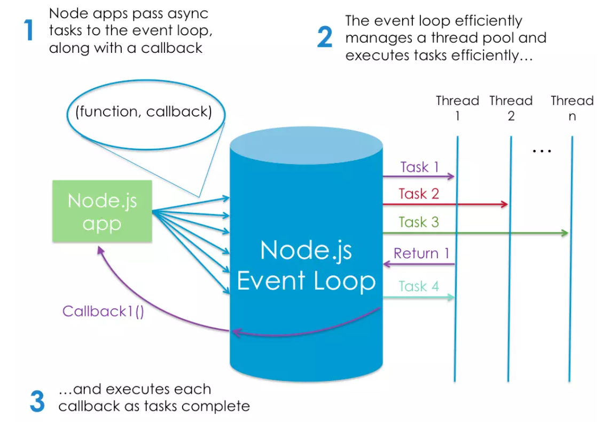

## An Introduction to Node.js on sitepoint.com 

**Node.js is an event-based, non-blocking, asynchronous I/O runtime that uses Google’s V8 JavaScript engine and libuv library.**

**Node Is Built on Google Chrome’s V8 JavaScript Engine**

**The V8 engine**is the open-source JavaScript engine that runs in Google Chrome and other Chromium-based web browsers, including Brave, Opera, and Vivaldi.  
It was designed with performance in mind and is responsible for compiling JavaScript directly to native machine code that your computer can execute.

Node is built on the V8 engine, we don’t mean that Node programs are executed in a browser. They aren’t. Rather, the creator of Node (Ryan Dahl) took the V8 engine and enhanced it with various features, such as a file system API, an HTTP library, and a number of operating system–related utility methods.

This means that **Node.js is a program we can use to execute JavaScript on our computers. In other words, it’s a JavaScript runtime.**

**Introducing npm, the JavaScript Package Manager**

**npm** is the package manager for JavaScript, npm is also the world’s largest software registry.

**What Is Node.js Used For?**

**Node and npm common uses**: installing (via npm) and running (via Node) various build tools — designed to automate the process of developing a modern JavaScript application.

These build tools come in all shapes and sizes, and you won’t get far in a modern JavaScript landscape without bumping into them. They can be used for anything from bundling your JavaScript files and dependencies into static assets, to running tests, or automatic code linting and style checking.

**Node.js Lets Us Run JavaScript on the Server**

One of the biggest use cases for Node.js — running JavaScript on the server.

**Node.js Execution Model**

In very simplistic terms, when you connect to a traditional server, such as Apache, it will spawn a new thread to handle the request. In a language such as PHP or Ruby, any subsequent I/O operations (for example, interacting with a database) block the execution of your code until the operation has completed. That is, the server has to wait for the database lookup to complete before it can move on to processing the result. If new requests come in while this is happening, the server will spawn new threads to deal with them. This is potentially inefficient, as a large number of threads can cause a system to become sluggish — and, in the worst case, for the site to go down. The most common way to support more connections is to add more servers.

**Node.js is single-threaded. It’s also event-driven, which means that everything that happens in Node is in reaction to an event.**

For example, when a new request comes in (one kind of event) the server will start processing it. If it then encounters a blocking I/O operation, instead of waiting for this to complete, it will register a callback before continuing to process the next event. When the I/O operation has finished (another kind of event), the server will execute the callback and continue working on the original request. 
-Under the hood, Node uses the libuv library to implement this asynchronous (that is, non-blocking) behavior.

Node’s execution model causes the server very little overhead, and consequently it’s capable of handling a large number of simultaneous connections. The traditional approach to scaling a Node app is to clone it and have the cloned instances share the workload. Node.js even has a built-in module to help you implement a cloning strategy on a single server.

Q1) What is node.js? 
Node.js is an event-based, non-blocking, asynchronous I/O runtime that uses Google’s V8 JavaScript engine and libuv library.

Q2) In your own words, what is Chrome’s V8 JavaScript Engine? 
It is an open-source JavaScript engine that runs in Google Chrome and other Chromium-based web browsers

Q3) What does it mean that node is a JavaScript runtime? 
It means that Node.js is a program we can use to execute JavaScript on our computers

Q4) What is npm? 
npm is the package manager for JavaScript

Q5) What version of node are you running on your machine? 
v12.21.0 (using the command node -v)

Q6) What version of npm are you running on your machine? 
7.13.0 (using the command npm -v)

Q7) What command would you type to install a library/package called ‘jshint’? 
npm install -g jshint

Q8) What is node used for? 
For running various build tools — designed to automate the process of developing a modern JavaScript application.

## 6 Reasons for Pair Programming

**How does pair programming work?**

Pair programming commonly involves two roles: **the Driver and the Navigator**.

**The Driver** is the programmer who is typing and the only one whose hands are on the keyboard. Handling the “mechanics” of coding, the Driver manages the text editor, switching files, version control, and—of course writing—code.

**The Navigator** uses their words to guide the Driver but does not provide any direct input to the computer. The Navigator thinks about the big picture, what comes next, how an algorithm might be converted in to code, while scanning for typos or bugs.

Q1) What are the 6 reasons for pair programming?
1.	Greater efficiency
2.	Engaged collaboration
3.	Learning from fellow students
4.	Social skills
5.	Job interview readiness
6.	Work environment readiness

Q2) In your experience, which of these reasons have you found most beneficial?
Learning from fellow students and enhancing the social skills

Q3) How does pair programming work?
The pair programming involves two roles: Driver and Navigator, each one of them has his/her own role.
The Driver is the programmer who is typing and the only one whose hands are on the keyboard.
The Navigator uses their words to guide the Driver but does not provide any direct input to the computer. The Navigator thinks about the big picture, what comes next, how an algorithm might be converted in to code, while scanning for typos or bugs.

**Resources**: 
-	[An Introduction to Node.js on sitepoint.com](https://www.sitepoint.com/an-introduction-to-node-js/)
-	[6 Reasons for Pair Programming](https://www.codefellows.org/blog/6-reasons-for-pair-programming/)

