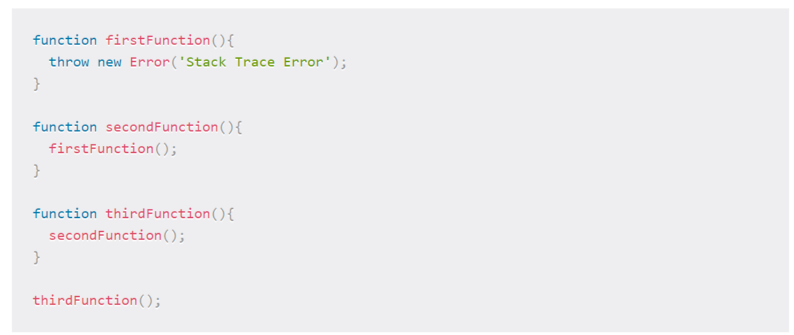

## Understanding the JavaScript Call Stack

**The JavaScript engine (which is found in a hosting environment like the browser), is a single-threaded interpreter comprising of a heap and a single call stack. The browser provides web APIs like the DOM, AJAX, and Timers.**

The call stack is primarily used for function invocation (call). Since the call stack is single, function(s) execution, is done, one at a time, from top to bottom. It means the call stack is synchronous.

**In Asynchronous JavaScript**, we have a callback function, an event loop, and a task queue. The callback function is acted upon by the call stack during execution after the call back function has been pushed to the stack by the event loop.

**Call stack** is a data structure that uses the Last In, First Out (LIFO) principle to temporarily store and manage function invocation (call).

**LIFO**: When we say that the call stack, operates by the data structure principle of Last In, First Out, it means that the last function that gets pushed into the stack is the first to be pop out, when the function returns.
Temporarily store: When a function is invoked (called), the function, its parameters, and variables are pushed into the call stack to form a stack frame. This stack frame is a memory location in the stack. The memory is cleared when the function returns as it is pop out of the stack.

**Manage function invocation (call)**: The call stack maintains a record of the position of each stack frame. It knows the next function to be executed (and will remove it after execution). This is what makes code execution in JavaScript synchronous.

**What causes a stack overflow?**

A stack overflow occurs when there is a recursive function (a function that calls itself) without an exit point. The browser (hosting environment) has a maximum stack call that it can accommodate before throwing a stack error.

Q1) What is a ‘call’? 
It is a data structure that uses the Last In, First Out (LIFO) principle to temporarily store and manage function invocation

Q2) How many ‘calls’ can happen at once? 
One call at a time.

Q3) What does LIFO mean? 
It means that the last function that gets pushed into the stack is the first to be pop out, when the function returns.

Q4) Draw an example of a call stack and the functions that would need to be invoked to generate that call stack. 

Q5) What causes a Stack Overflow? 
It occurs when there is a recursive function (a function that calls itself) without an exit point.

## JavaScript error messages

Q1) What is a ‘refrence error’? 
It is an error that appears when you try to use a variable that is not yet declared. Also a common thing when using const and let, they are hoisted like var and function but there is a time between the hoisting and being declared so when you try to access them a reference error occurs

Q2) What is a ‘syntax error’? 
It is an error that occurs when you have something that cannot be parsed in terms of syntax,

Q3) What is a ‘range error’? 
It is thrown when trying to pass a value as an argument to a function that does not allow a range that includes the value

Q4) What is a ‘tyep error’? 
It is an error that show up when the types (number, string and so on) you are trying to use or access are incompatible, like accessing a property in an undefined type of variable.

Q5) What is a breakpoint? 
It is the place where code execution can be stopped.

Q6) What does the word ‘debugger’ do in your code? 
The debugger keyword stops the execution of JavaScript, and calls (if available) the debugging function.

**Recourses:**

 - [Understanding the JavaScript Call Stack](https://www.freecodecamp.org/news/understanding-the-javascript-call-stack-861e41ae61d4/)

 - [JavaScript error messages](https://codeburst.io/javascript-error-messages-debugging-d23f84f0ae7c)

